# Create A Request in Direct Mode

### Summary

In **Direct mode** , user can create 2 types request as **'New Concept'** or **'Change or Retire Concept'**. A difference with Simple form would be the Edit Panel in the left hand side, and it requires the user to have knowledge of the system to be able to use it. New request will be added into the My Request list in status **Draft** or**New** after user saved or submitted request.

### Panels In Direct Mode

There are 4 panels in Direct mode, started from left to right:

  * **Edit Mode Switcher** (1), on this panel there are 2 buttons which are used to switch between Simple and Direct mode. If there is any change is made from **Direct** mode, the switcher will be disable and user cannot view request details in **Simple** mode. However, if there is any change in **Simple** mode, user can view them in **Direct** mode.

  * **Left Panel** (2), there are 4 tabs in left panel 

<figure>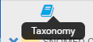<figcaption>
,
</figcaption></figure>

<figure>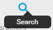<figcaption>
, **
</figcaption></figure>

<figure>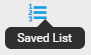<figcaption>
**, and
</figcaption></figure>

<figure><figcaption>
.
</figcaption></figure>

    * **Taxonomy** tab allows user to browse concepts in tree view

    * **Search** tab allows user to look for their desire concept quickly with suggestions (start showing suggestions after typing 3 characters)

    * **Saved List** tab shows saved concepts from **Search** tab. User can drag & drop concepts from **Saved List** to **Edit Panel** (4)

    * **Request Info** tab shows request statistics and corresponding buttons for each request status

    * <figure>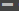<figcaption>
Remove a concept description or relationship
</figcaption></figure>

  * **Middle Panel** (3) allows you to enter further information for a request

  * **Edit Panel** (4) where you provide values for concept's attributes such as synonyms, prefer term, relationships. Below are command buttons in 

    * <figure>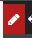<figcaption>
button to provide change details for a concept
</figcaption></figure>

    * <figure><figcaption>
Undo changes
</figcaption></figure>

    * <figure><figcaption>
Redo changes
</figcaption></figure>

    * <figure>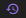<figcaption>
Revert all changes
</figcaption></figure>

    * <figure><figcaption>
Remove concept from Edit Panel
</figcaption></figure>

    * <figure>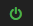<figcaption>
Activate or Inactivate a concept
</figcaption></figure>

    * <figure><figcaption>
Drag & Drop button
</figcaption></figure>

    * <figure><figcaption>
Activate or Inactivate a description or a relationship
</figcaption></figure>

    * <figure><figcaption>
Add a new concept description or relationship
</figcaption></figure>

 _

<figure>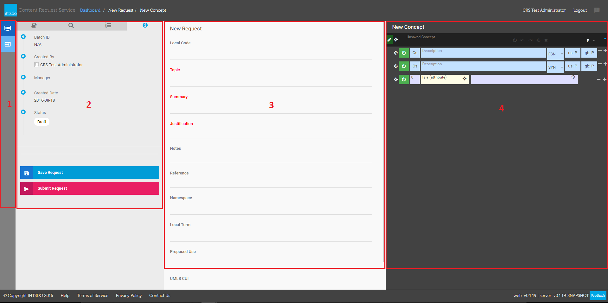<figcaption>
_
</figcaption></figure>

_Figure 2 - Panels in Direct Mode_

### Getting Started - Create Request

From **CRS Dashboard** (Figure 1), click on **Create New Request** (1), select **Direct** (2) from **Input Mode**

<figure>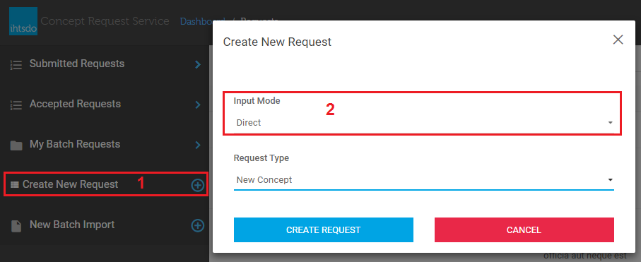<figcaption>
<em>Figure 1 - Select Direct Mode</em>
</figcaption></figure>

 _  
_

### New Concept

To create a new concept request by using direct mode, from **CRS Dashboard** (Figure 1) click on **Create New Request** (1), select Direct from **Input Mode** (2) drop-down list, select **New Concept** from **Request Type** (3) drop-down list, and click on **Create Request** (4) button to go to request details editor. 

**

<figure>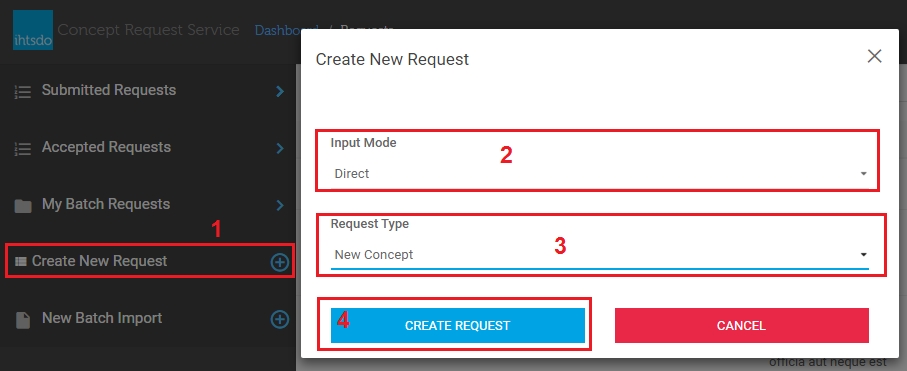<figcaption>
**
</figcaption></figure>

**_Figure 3 - Select New Concept in Direct Mode_**

### Add New Description 

Click 

<figure><figcaption>
button which is on each description row to add a new row of description
</figcaption></figure>

 __Notes:__

<figure>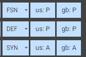<figcaption>
FSN/DEF/SYN are Fully Specified Name (FSN) , Definition (DEF), and Synonym (SYN)<locale>: P/A are the locale 2-digit code (us for USA, gb for Great Britain), and Preferred/Acceptable terms, abbreviated as P and A respectively
</figcaption></figure>

 _So in the above examples:_  
The first row indicates that the Fully Specified Name is the preferred term in both US and GB dialects of English  
The second row indicates a Definition that is the preferred term in both US and GB dialects of English  
The third row indicates a Synonym that is an accepted term in both US And GB dialects of English

<figure>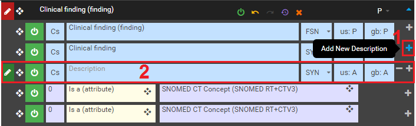<figcaption>
<em>Figure 4 - Add New Synonym</em>
</figcaption></figure>

### Add New Relationship

Click 

<figure><figcaption>
button which is on each relationship row to add new relationship.
</figcaption></figure>

Click on **Relationship Type** field (1) to select item , and then **Drag and drop** a concept from **the left panel** (2) to **the destination concept** (3). if you don't want to drag & drop, then you can type in the target concept textbox, CRS will suggest corresponding concept (4) for your keyword.

_

<figure>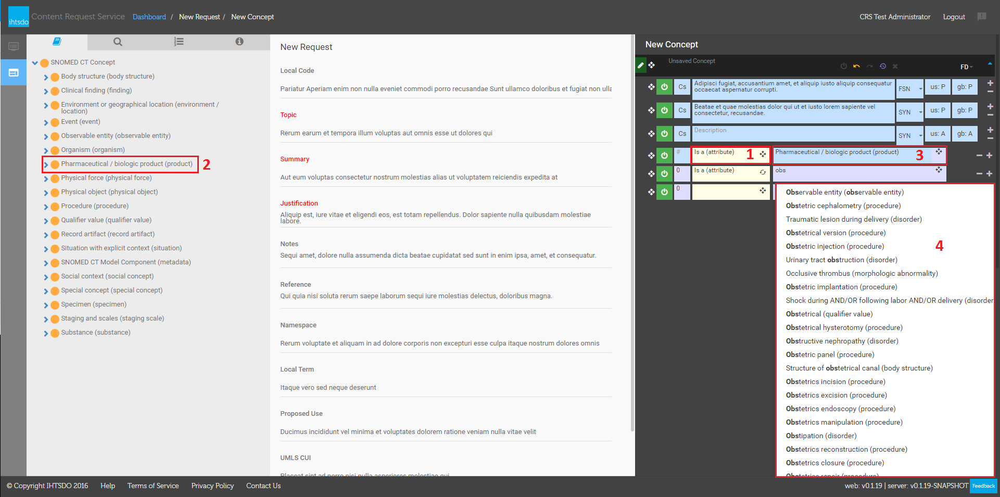<figcaption>
_
</figcaption></figure>

  

_Figure 5 - Add New Relationship_

### Change or Retire Concept

To create a new request for Change or Retire Concept by using Direct mode, from CRS Dashboard (Figure 1) click on Create New Request (1), select Direct from Input Mode (2) drop-down list, select Change or Retire Concept from Request Type (3) drop-down list, and click on Create Request (4) button to go to request details editor. 

Drag & drop a concept from Left Panel (1) to the Edit Panel area (2) to load concept's details (3) .

<figure>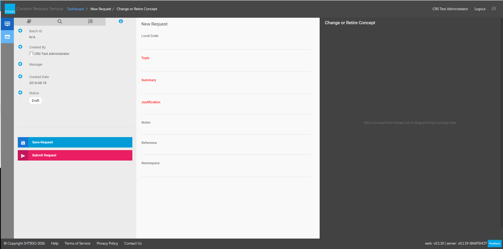<figcaption>
<em>Figure 6 - Compose a Change or Retire Concept in Direct mode</em>
</figcaption></figure>

 _

<figure>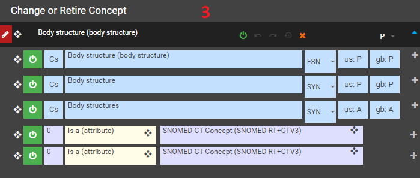<figcaption>
_
</figcaption></figure>

  

_Figure 7 - Drag & Drop Concept to Edit Panel_

### Inactivate a Description

Click on 

<figure>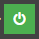<figcaption>
button (1) of the description which you want to retire, there will be a modal dialog displayed, select a <strong>New Description Status</strong> (2) option then click <strong>Select</strong> (3)
</figcaption></figure>

<figure>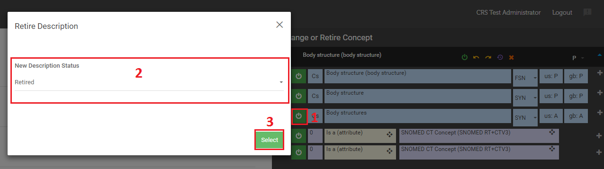<figcaption>
<em>Figure 8 - Retire a Description</em>
</figcaption></figure>

 _  
_

<figure>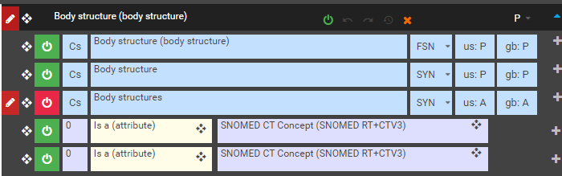<figcaption>
<em>Figure 18 - Retired Description With Indicator</em>
</figcaption></figure>

### Inactivate a Concept

Click on 

<figure>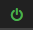<figcaption>
button (1) to show <strong>the modal dialog</strong> (2) to populate relevant information, and then click on <strong>Select</strong> (3) button to retire concept.
</figcaption></figure>

<figure>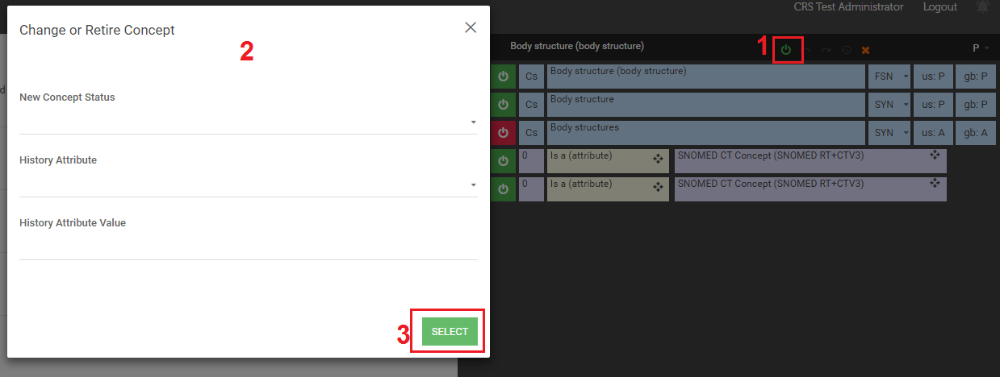<figcaption>
<em>Figure 19 - Retire concept</em>
</figcaption></figure>

