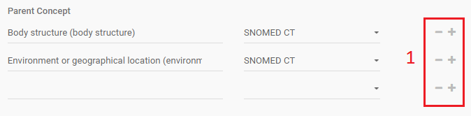
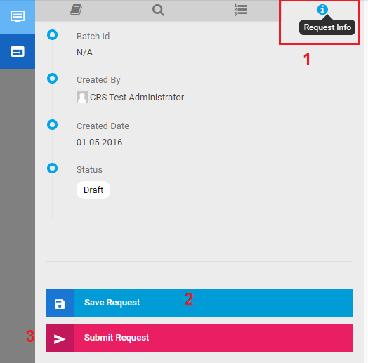
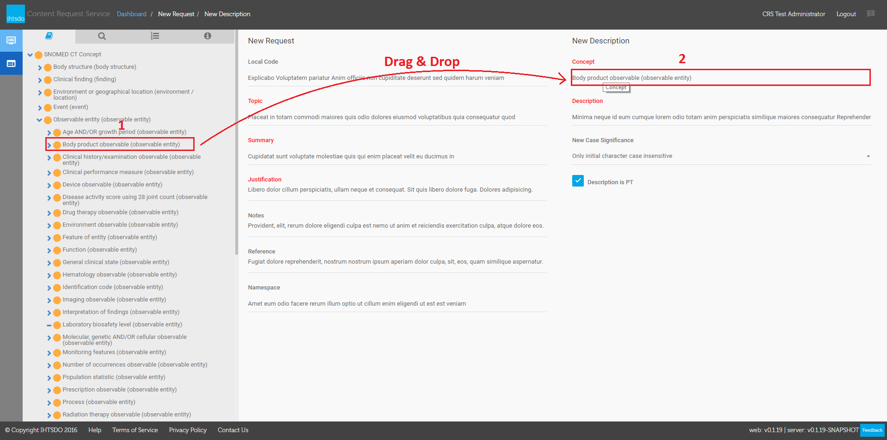
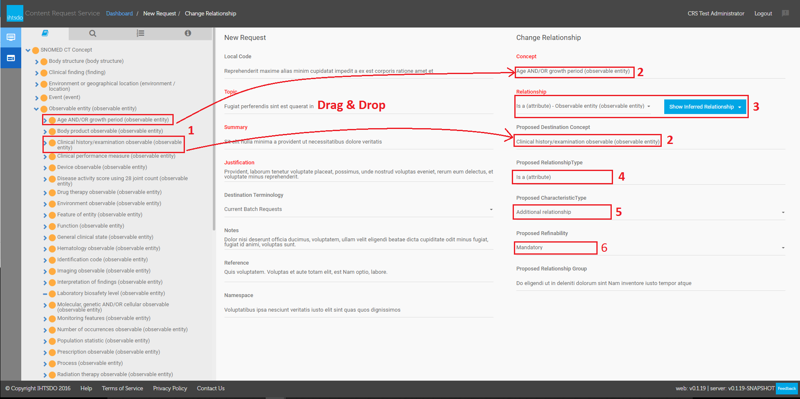
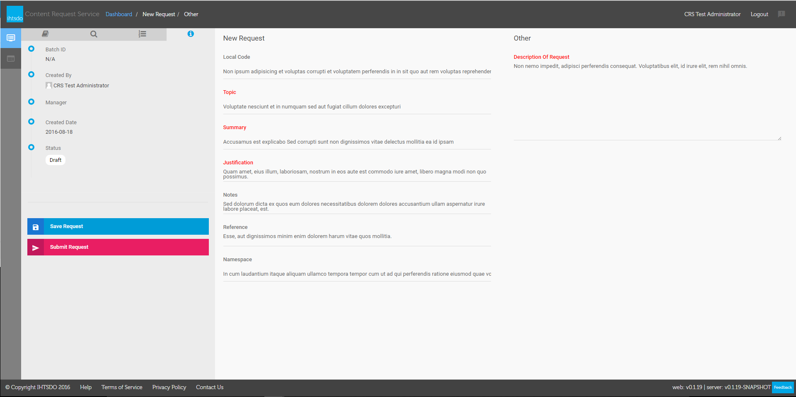

# Create A Request in Simple Mode

## Summary

In **Simple mode** , user can create more types request as **'New Concept'** , **'New Description'** , **'New Relationship'** , **'Change Description'** , **'Change Relationship'** , **'Retire Description'** , **'Retire Relationship'** , **'Change or Retire Concept'** or **'Other'** . In this mode, user is provided an easy user interface to use. As well as Direct mode, new request will be added into the My Request list in status **Draft** or**New** after user saved or submitted request.

## Dashboard

From **CRS Dashboard** (Figure 1), click on **Create New Request** (1), select **Simple** (2) from **Input Mode**|

<figure><figcaption>
---|---
</figcaption></figure>

_Figure 2 - Select Simple Mode_

## New Concept

**Select**New Concept\*\* (3) from drop-down list **Request Type** and click **Create Request** (4) **|**

**---|---**

_**Figure 3 - Select New Concept Type**_\
**Select tab Taxonomy (1), Search or Saved List from the left panel to select a desire concept to drag & drop to Parent Concept (3) field. And then Source Terminology(4) is set automatically to SNOMED CT. But if this request is opened from Batch Requests, Terminology Suggestion(4) is set to**Current Batch.\*\*|

<figure><figcaption></figcaption></figure>

_Figure 4 - Compose a New Concept_\
If you want to add more Parent Concept, click on the **plus** icon

<figure><figcaption></figcaption></figure>

on each Parent Concept (1) to add.If you want to remove a Parent Concept, click on the **minus** icon

<figure><figcaption></figcaption></figure>

on each Parent Concept (1) to remove.|

<figure><figcaption></figcaption></figure>

_Figure 4.1 - Add/Remove Parent Concept_\
If you want to add more **Synonyms** , click on the plus icon

<figure><figcaption></figcaption></figure>

on each synonym (1) to add. if you want to remove a synonym, click on

<figure><figcaption></figcaption></figure>

button on each synonym to remove. do the same with **Definition**(2).| \_

<figure><figcaption></figcaption></figure>

\__Figure 5 - Add More Synonyms and Definitions_\
Select tab **Request Info** (1) to **save**(2) the request with **Draft** status which allows you to edit request details before submit, or **submit** (3) the request to manager/staff. Request details editing is locked after submitted.| \_

<figure><figcaption></figcaption></figure>

\__Figure 6 - Save or Submit Request_

## New Description

Select **New Description** from **Request Type** drop-down list and click **Create Request** button (Figure 7)|

<figure><figcaption>
---|---
</figcaption></figure>

_Figure 7 - Select New Description_\
Search or browse for a desire concept from **the left panel** (1) to drag & drop it into **Concept** field (2), enter request details to Save or Submit the request (Figure 6).|

<figure><figcaption></figcaption></figure>

_Figure 8 - Compose a New Description_

## New Relationship

Select **New Relationship** from **Request Type** drop-down list and click **Create Request** button (Figure 3)Search or browse for a desire Source Concept, Relationship Type, and Destination Concept from **the left panel** (1) to **drag & drop** it into each **corresponding fields** (2), enter request details to Save or Submit the request (Figure 6).|

\|---

## Change or Retire Concept

Select **Change or Retire Concept** from **Request Type** drop-down list and click **Create Request** button (Figure 3)Search or browse for a desire Concept from **the left panel** (1) to **drag & drop** into each **corresponding fields** (2), select a **New Concept Status (3)** and **History Attribute (4),** and then enter request details to Save or Submit the request.**e**|

\|---

## Change Description

Select **Change Description** from **Request Type** drop-down list and click **Create Request** button (Figure 3)Search or browse for a desire Concept from **the left panel** (1) to **drag & drop** into **Concept field** (2), select **Active Description**(3) and **New Case Significance** (4) that you want to change, and then enter request details to Save or Submit the request.|

\|---

## Change Relationship

Select **Change Description** from **Request Type** drop-down list and click **Create Request** button (Figure 3)Search or browse for a desire Concept from **the left panel** (1) to **drag & drop** into **Concept field** (2), select **Active Description**(3) and **New Case Significance** (4) that you want to change, and then enter request details to Save or Submit the request.|

\|---

Select **Change Relationship** from **Request Type** drop-down list and click **Create Request** button (Figure 3)

Search or browse for a desire Concept from **the left panel** (1) to **drag & drop** it into **corresponding fields** (2), select a **Relationship** (3) , **Proposed RelationshipType** (4), **Proposed CharacteristicType** (5), **Proposed Refinability**(6) that you want to change and then enter request details to Save or Submit the request.

## Retire Description

Select **Retire Description** from **Request Type** drop-down list and click **Create Request** button (Figure 3)Search or browse for a desire Concept from **the left panel** (1) to **drag & drop** it into **Concept field** (2), select a **Active Description**(3) and **New Description Status**(4), that you want to retire and then enter request details to Save or Submit the request.|

<figure><figcaption>
---|---
</figcaption></figure>

_Figure 12 - Compose a Change Relationship_\
|

<figure><figcaption></figcaption></figure>

_Figure 13 - Compose a Retire Description_

## Retire Relationship

| Select **Retire Relationship** from **Request Type** drop-down list and click **Create Request** button (Figure 3)Search or browse for a desire Concept from **the left panel** (1) to **drag & drop** it into **Concept field** (2), select a **Relationship**(3) , **Relationship\*\*\*\*Status**(4) and **Destination Terminology** (5) that you want to retire and then enter request details to Save or Submit the request. | 
<figure><figcaption>
<em>Figure 14 - Compose a Retire Relationship</em>
</figcaption></figure>
 |
| -------------------------------------------------------------------------------------------------------------------------------------------------------------------------------------------------------------------------------------------------------------------------------------------------------------------------------------------------------------------------------------------------------------------------------- | ------------------------------------------------------------------------------------------------------------------------------------------------------- |

## Other

Select **Other** from **Request Type** drop-down list and click **Create Request** button (Figure 3)Enter request details to Save or Submit the request.|

<figure><figcaption>
---|---
</figcaption></figure>

_Figure 14 - Compose a Other request_
