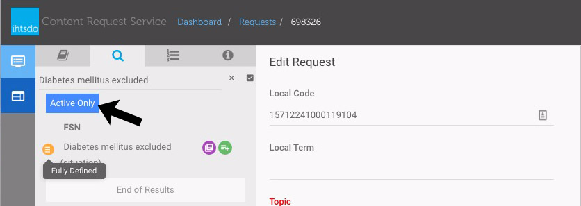

# Search, Taxonomy, and Using Drag and Drop

## Search Terms

In many cases you will want to search for one or more concepts for the purposes of editing or reference. The search tab allows you to search SNOMED by typing text in the search field. After pressed Enter key, it will lists all concepts that match your query. The search tab contains a number of features:

* View search results by matching terms or grouped by concept
* Distinguish between primitive and fully defined concepts in a set of search results
* Distinguish between active and inactive concepts in a set of search results
* View more details about a concept in a set of search results
* Add concepts from a set of search results to a saved list for future use
* You can use wildcards in the search term to find partial matches. Asterisk ( \* ) matches all subsequent characters regardless of word length. Question mark ( ? ) matches a single character. For example:

punc\* would find all words stemmed with "punc" eg punch, punched, punctum, puncture etc\
punc? would find punch\
punc??? would find punched and punctum\
punc?u? would find punctum but not punched

## Search by Concept Id and drag and drop to fields in a request

| Steps                                                                                                                                                                                                                                                                                         | Reference                                                                                      |
| --------------------------------------------------------------------------------------------------------------------------------------------------------------------------------------------------------------------------------------------------------------------------------------------- | ---------------------------------------------------------------------------------------------- |
| If desired a single concept id can be used to locate a specific concept. This is useful for newly created concepts.Concepts from search can be dragged and dropped by selecting the concept by pressing and holding on the FSN.The UI will then highlight the areas that are "drop zones" (A) | 
<figure><figcaption></figcaption></figure>
 |
| Drag the concept to the desired form field and let go to populate the field with this concept.                                                                                                                                                                                                | 
<figure><figcaption></figcaption></figure>
 |

## View search results by matching terms or grouped by concept

| Steps                                                                                                                                                                                                                                                 | Reference                                                                                      |
| ----------------------------------------------------------------------------------------------------------------------------------------------------------------------------------------------------------------------------------------------------- | ---------------------------------------------------------------------------------------------- |
| From the search tab, you may type a query into the search field and the search widget will begin to locate results. You can toggle your results view between matching terms or grouped by concept by selecting the checkbox next to the search field. | 
<figure><figcaption></figcaption></figure>
 |
| View Matching TermsThis search query returns all cases of a query. Eg. If i search for **Diabetes mellitus excluded** I may recieved 2 search results for this concept since my word "_diabetes_ " is used three times when defining this concept.    | 
<figure><figcaption></figcaption></figure>
 |
| Grouped By ConceptFor this same search query, if I select Grouped By Concept, I will only receive one search result for each concept, narrowing my search result to one.                                                                              | 
<figure><figcaption></figcaption></figure>
 |

## Distinguish and filter between active, inactive, primitive and fully defined concepts in a set of search results

* In a set of search results a primitive concept is identified by a

<figure><figcaption>
Primitive icon and a fully defined concept is identified by a
</figcaption></figure>

<figure><figcaption>
Fully Defined icon.
</figcaption></figure>

* In a set of search results an inactive concept is identified by a

<figure><figcaption>
icon.
</figcaption></figure>

<figure><figcaption>
If desired search results can be filtered to active concepts only by selecting the Active Only button
</figcaption></figure>

<figure><figcaption></figcaption></figure>

## View more details about a concept in a set of search results, and its position in the taxonomy

From a set of search results you may want to view more details about a concept before adding it to your saved list or selecting it for editing. To do so click either the

<figure><figcaption>
or
</figcaption></figure>

<figure><figcaption>
icon within the concept that you wish to display the details of and a modal will appear.
</figcaption></figure>

<figure><figcaption></figcaption></figure>

### Add Concepts From Search Results to the Saved List

If you want to save a concept into the Saved List from the search results, you can click the 'add' button

<figure><figcaption>
to add the concept into the Saved List. After the concept is added, the 'add' button is disabled
</figcaption></figure>

<figure><figcaption>
, so you can't add the same concept into the Saved List twice.
</figcaption></figure>

<figure><figcaption></figcaption></figure>

### Viewing a concept in the taxonomy within CRS and use it in a drag and drop scenario

From various components of the CRS tool a

<figure><figcaption>
View in Taxonomy button can be used to show a concept's position in the taxonomy. Selecting the View in Taxonomy button will load the concept in the Taxonomy pane.
</figcaption></figure>

Note: only one concept can be viewed at a time and selecting a different concept will replace the Taxonomy tree with that of the newly selected concept.

<figure><figcaption>
Concepts from search can be dragged and dropped by selecting the concept by pressing and holding on the FSN.
</figcaption></figure>

The UI will then highlight the areas that are "drop zones"

Drag the concept to the desired form field and let go to populate the field with this concept.

<figure><figcaption></figcaption></figure>
