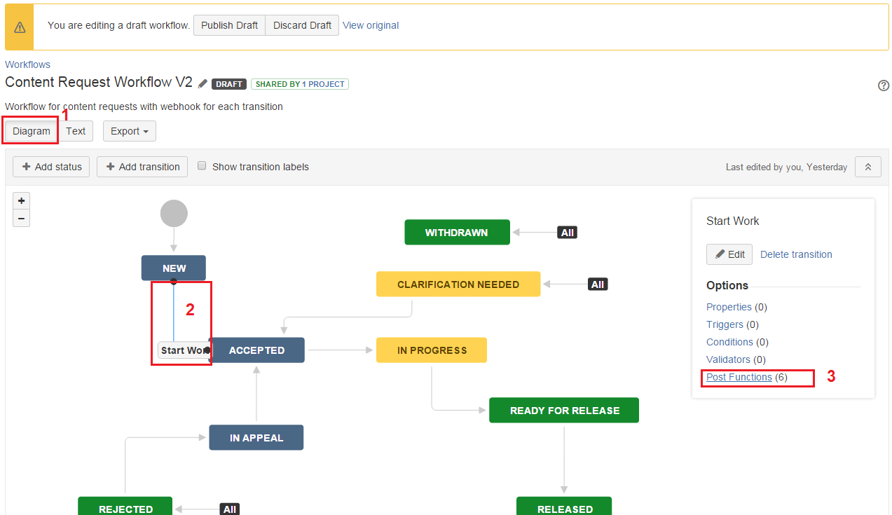

# CRS Deployment Check List

## **I) Back-end**

#| Actions  
---|---  
1| 

  * Install Java 7

  
2| 

  * Install Tomcat 7 or 8

  
3| 

  * Install MySQL 5.6

  
4| 

  * Copy back-end package to Prod server location

  
  
## **II) Front-end**

#| Actions  
---|---  
1| 

  * Install nodejs v4.0.0

  
2| 

  * Install gem v2.5.0

  
3| 

  * Install grunt-cli v0.1.13

  
4| 

  * Copy front-end source to Prod server location

  
  
**III) JIRA Webhook Configurations**

  * ### Create CRS Webhook

from the project that is used for CRS to create JIRA ticket, go to **System** (Figure 1) > **Webhooks**(Figure 2) from the left panel under **Advanced** group  

<figure><figcaption>
<em>Figure 1 - System menu item</em>
</figcaption></figure>

  
  

<figure><figcaption>
<em>Figure 2 - Webhooks menu item</em>
</figcaption></figure>

  
  
On the page of webhook, click on 

<figure><figcaption>
to go to new webhook screen (Figure 3). Provide a <strong>Name</strong> (1) for the webhook, select <strong>Enable</strong> (2) option, use this URL https://<strong>[CRS-Environment]</strong>.ihtsdotools.org/ihtsdo-crs/api/request/statusChange/${issue.key}?modifier=${modifiedUser.name} to provide into <strong>URL</strong> (3) field, and in <strong>Events</strong> (4) we can use JQL query to limit the scope of webhook, in the example below, I limited the webhook's scope at CRT project only.
</figcaption></figure>

<figure><figcaption>
<em>Figure 3 - New Webhook screen</em>
</figcaption></figure>

  
  
  

  * ### Add webhook to Post Functions of workflow's transition

Navigate to the JIRA project where CRS create tickets for requests, in this context it's CRT project. Click on 

<figure><figcaption>
and <strong>Workflows</strong> (Figure 4) from the left panel, click on the pencil icon
</figcaption></figure>

<figure><figcaption>
to edit workflow.
</figcaption></figure>

<figure><figcaption>
<em>Figure 4 - Project Workflows</em>
</figcaption></figure>

<figure><figcaption>
<em>Figure 5 - Edit Workflow</em>
</figcaption></figure>

Click on **Diagram** (1) button to view the workflow in graphic, click on a transition (2) to show the transition's context menu, click on **Post Functions** (3) 

 _

<figure><figcaption>
_
</figcaption></figure>

__Figure 6 - Edit Workflow - Add Post Functions__

Follow instruction below to add webhook into a transition (Figure 7)

<figure><figcaption>
<strong>Figure 7 - Add Post Functions - Step-By-Step</strong>
</figcaption></figure>

Do the same for the rest of workflow's transitions.
