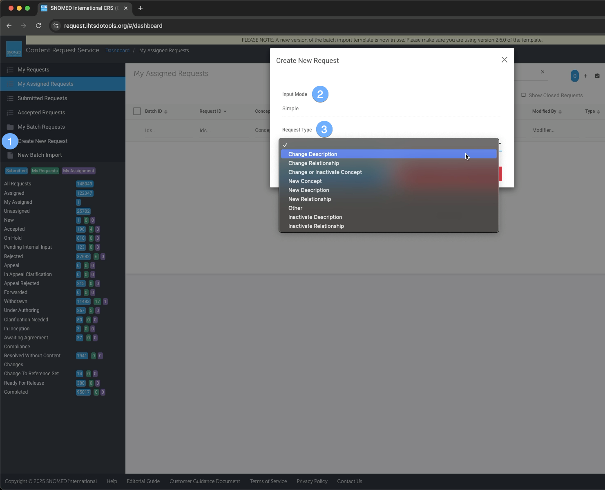
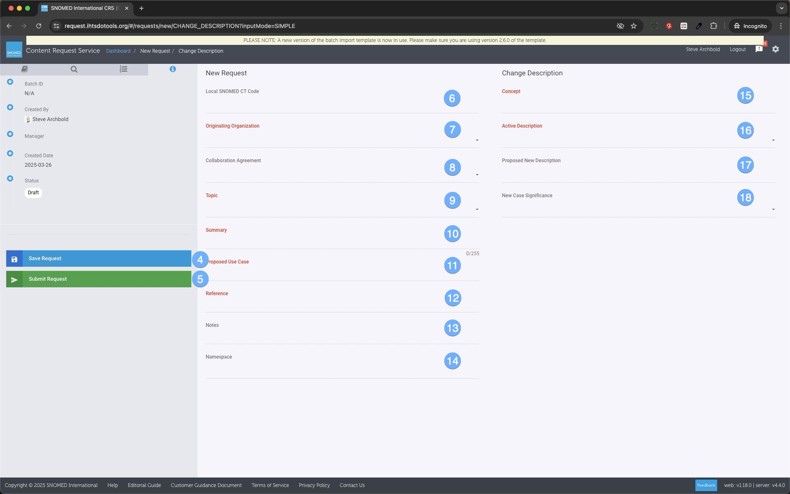
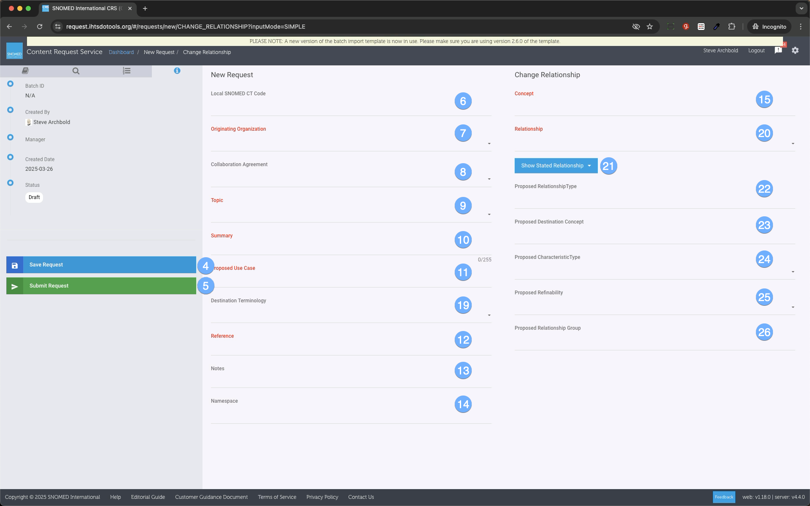
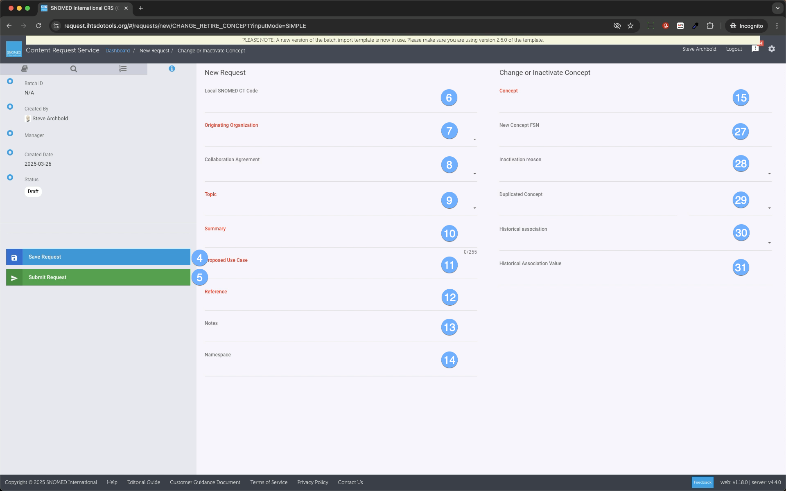
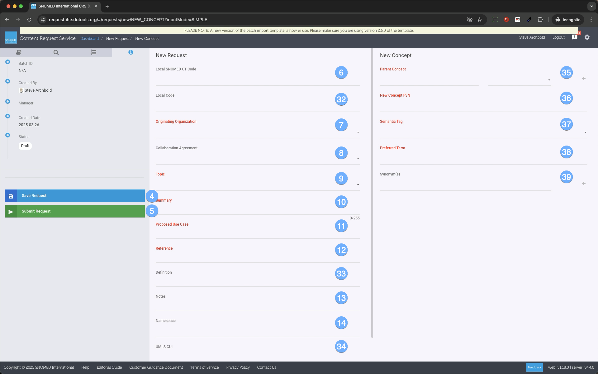
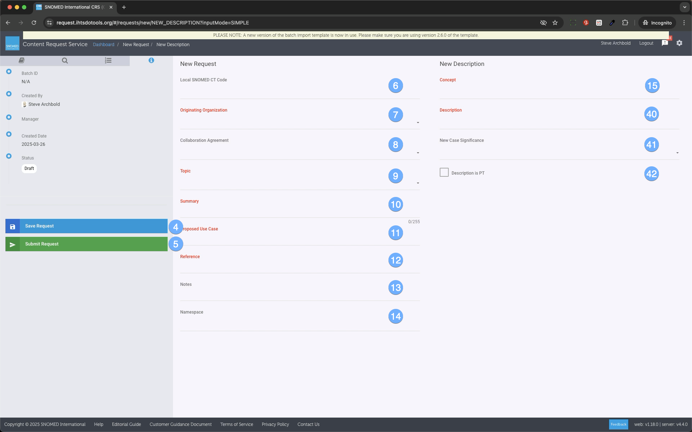

# End to End Work Flow - Simple Mode

Getting Started - Create Request

| Steps| Reference |
|----|-------|
|  
  1. Press "Create New Request" in the left sidebar (1).
  2. The system will load the create New Request dialog box; select an input mode (2) (direct or simple) and a desired Request Type template (3), then press **Create Request** in the dialogue box.
  3. 
To jump to the next steps please select the desired request combination:**** | <figure></figure> |
  
#### Simple mode - Change Description

| Steps| Reference |
|----|-------|
| 3\. The system will load the New Request screen; fill out the request details:

  *     * Local SNOMED CT code (6) - Local SNOMED CT extension code - _optional_
    * Originating Organization (7)  \- The source of the request ex: Organization Name Donation _\- required_
    * Collaboration Agreement (8) - CMT or LOINC - _optional_
    * Topic (9) - What category the request falls under _\- required_
    * Summary (10) - Usually the FSN that is the subject of the request _\- required_
    * Proposed Use Case (11) - Describe the usage scenario - _required_
    * Reference (12) - Supporting notes as to why the content request should be completed
    * Notes (13) - Any additional comments desired to be made about the request
    * Namespace (14) -  _optional_

4\. To change a description, fill out the following fields:

  *     * Concept (15) - The concept containing the description which is desired to be changed. For more info on populating this field via search or taxonomy see: [Search, Taxonomy, and Using Drag and Drop](31033178.html) or using type ahead see [Using Type Ahead Within CRS](Using-Type-Ahead-Within-CRS_31033205.html)
    * Active Description (16) - Select which of the descriptions from the selected concept should be changed
    * Proposed New Description (17) - Type the new description term
    * New Case Significance (18) - Set the Case Significance of the New Description

5\. Press **Save Request** (4) to save your work or press **Submit Request** (5) to submit it. The request will have a status of **New** and you will be redirected to the dashboard.6\. Jump to: What happens after my Request has been submitted? | <figure></figure>  |
  
#### Simple mode - Change Relationship

Steps| Reference  
---|---  
3\. The system will load the New Request screen; fill out the request details:

  *     * Local SNOMED CT code (6) - Local SNOMED CT extension code - _optional_
    * Originating Organization (7)  \- The source of the request ex: Organization Name Donation _\- required_
    * Collaboration Agreement (8) - CMT or LOINC - _optional_
    * Topic (9) - What category the request falls under _\- required_
    * Summary (10) - Usually the FSN that is the subject of the request _\- required_
    * Proposed Use Case (11) - Describe the usage scenario - _required_
    * Destination Terminology (19) - SNOMED CT International or New Concept Requests -  _optional_
    * Reference (12) - Supporting notes as to why the content request should be completed
    * Notes (13) - Any additional comments desired to be made about the request
    * Namespace (14) -  _optional_

4\. To change a relationship, fill out the following fields:

  *     * Concept (15) \- The concept containing the description which is desired to be changed. For more info on populating this field via search or taxonomy see: [Search, Taxonomy, and Using Drag and Drop](31033178.html) or using type ahead see [Using Type Ahead Within CRS](Using-Type-Ahead-Within-CRS_31033205.html)
    * Relationship (20) - Select which of the descriptions from the selected concept should be changed
    * Select Show Stated Relationship or Show Inferred Relationship (21)
    * Proposed RelationshipType (22)
    * Proposed Destination Concept (23) \- For more info on populating this field via search or taxonomy see: [Search, Taxonomy, and Using Drag and Drop](31033178.html) or using type ahead see [Using Type Ahead Within CRS](Using-Type-Ahead-Within-CRS_31033205.html)
    * Proposed CharacteristicType (24)
    * Proposed Refinability (25)
    * Proposed Relationship Group(26)

5\. Press **Save Request** (4) to save your work or press **Submit Request** (5) to submit it. The request will have a status of **New** and you will be redirected to the dashboard.6\. Jump to: What happens after my Request has been submitted?| <figure></figure>  
  
#### Simple mode - Change or Inactivate Concept

Steps| Reference  
---|---  
3\. The system will load the New Request screen; fill out the request details:

  *     * Local SNOMED CT code (6) - Local SNOMED CT extension code - _optional_
    * Originating Organization (7)  \- The source of the request ex: Organization Name Donation _\- required_
    * Collaboration Agreement (8) - CMT or LOINC - _optional_
    * Topic (9) - What category the request falls under _\- required_
    * Summary (10) - Usually the FSN that is the subject of the request _\- required_
    * Proposed Use Case (11) - Describe the usage scenario - _required_
    * Reference (12) - Supporting notes as to why the content request should be completed
    * Notes (13) - Any additional comments desired to be made about the request
    * Namespace (14) -  _optional_

4\. To change or inactivate a concept, fill out the following fields:

  *     * Concept (15) - The concept containing the description which is desired to be changed. For more info on populating this field via search or taxonomy see: [Search, Taxonomy, and Using Drag and Drop](31033178.html) or using type ahead see [Using Type Ahead Within CRS](Using-Type-Ahead-Within-CRS_31033205.html)
    * New Concept FSN (27)
    * Inactivation Reason (28)
    * Duplicated Concept (29)
    * Historical Association (30)
    * Historical Association Value (31)

5\. Press **Save Request** (4) to save your work or press **Submit Request** (5) to submit it. The request will have a status of **New** and you will be redirected to the dashboard. 6\. Jump to: What happens after my Request has been submitted?| <figure></figure>  
  
#### Simple mode - Create New Concept

Steps| Reference  
---|---  
3\. The system will load the New Request screen; fill out the request details:

  *     * Local SNOMED CT code (6) - Local SNOMED CT extension code - _optional_
    * Local code (32) - Local non-SNOMED CT reference code - _optional_
    * Originating Organization (7)  \- The source of the request ex: Organization Name Donation _\- required_
    * Collaboration Agreement (8) - CMT or LOINC - _optional_
    * Topic (9) - What category the request falls under _\- required_
    * Summary (10) - Usually the FSN that is the subject of the request _\- required_
    * Proposed Use Case (11) - Describe the usage scenario - _required_
    * Reference (12) - Supporting notes as to why the content request should be completed
    * Definition(s) (33) - _optional_
    * Notes (13) - Any additional comments desired to be made about the request
    * Namespace (14) -  _optional_
    * UMLS CUI (34) - _optional_

4\. To create a new Concept, fill out the following fields:

  *     * Parent Concept (35) _-_ For more info on populating this field via search or taxonomy see: [Search, Taxonomy, and Using Drag and Drop](31033178.html) or using type ahead see [Using Type Ahead Within CRS](Using-Type-Ahead-Within-CRS_31033205.html) _\- optional_
    * New Concept FSN (36)
    * Semantic Tag (37)
    * Preferred Term (38)
    * Synonym(s) (39)

5\. Press **Save Request** (4) to save your work or press **Submit Request** (5) to submit it. The request will have a status of **New** and you will be redirected to the dashboard. 6\. Jump to: What happens after my Request has been submitted?| <figure></figure>  
  
#### Simple mode - Create New Description

Steps| Reference  
---|---  
3\. The system will load the New Request screen; fill out the request details:

  *     * Local SNOMED CT code (6) - Local SNOMED CT extension code - _optional_
    * Originating Organization (7)  \- The source of the request ex: Organization Name Donation _\- required_
    * Collaboration Agreement (8) - CMT or LOINC - _optional_
    * Topic (9) - What category the request falls under _\- required_
    * Summary (10) - Usually the FSN that is the subject of the request _\- required_
    * Proposed Use Case (11) - Describe the usage scenario - _required_
    * Reference (12) - Supporting notes as to why the content request should be completed
    * Notes (13) - Any additional comments desired to be made about the request
    * Namespace (14) -  _optional_

4\. To create a new Description, fill out the following fields:

  *     * Concept (15) - The concept containing the description which is desired to be changed. For more info on populating this field via search or taxonomy see: [Search, Taxonomy, and Using Drag and Drop](31033178.html) or using type ahead see [Using Type Ahead Within CRS](Using-Type-Ahead-Within-CRS_31033205.html)
    * Description (40) - Create New Description Here _\- required_
    * New Case Significance (41) - _optional_
    * Checkbox for Description is PT (42) - _optional_

5\. Press **Save Request** (4) to save your work or press **Submit Request** (5) to submit it. The request will have a status of **New** and you will be redirected to the dashboard. 6\. Jump to: What happens after my Request has been submitted?| <figure><figcaption>
<strong>Request Form Glossary</strong>
</figcaption></figure>  
  
  

  

Term| Explanation  
---|---  
Local SNOMED CT code| Local SNOMED CT extension code -_optional_  
Local code| Local non-SNOMED CT reference code - _optional_  
Topic| What category the request falls under _\- required_  
Summary| Usually the FSN that is the subject of the request  _\- required_  
  
Proposed Use Case| It is very important to incorporate a clear use case for any change request for the International Edition of SNOMED CT. For example “Used as a member of a value set in support of the provider occupation field.” This level of detail will assist the Content Team in understanding the nature and context of the requirement. The justification will also aid in assessing the risks and benefits that are associated with making the change. Please remember that change requests that are country specific are not suitable for the International Edition. This type of change request will not be accepted. Please note that Justification is a mandatory field when making a submission. Copy and paste of generic text such as “gap in terminology” does not supply adequate justification for a change and may result in further clarification (which will delay the inclusion of the request) or a status change to “Not accepted.”  
Semantic Tag|  It is important to consider where the requested concept will sit within the SNOMED CT hierarchy. The requester must take into account the nature of their requirement along with how it will be implemented in clinical systems. When making a request for a new concept the desired semantic tag for the new addition is required as part of the submission. This will assist the Content Team in understanding the nature of the requirement and also help in ensuring that the original requirements are met. The requester should verify that the requested semantic tag aligns with the requested parent term. For example a request for a new concept in the finding hierarchy must be a descendant of the concept 404684003|Clinical finding (finding). Further information about the semantic tag can be found in the Editorial Guide: [Fully Specified Name](https://confluence.ihtsdotools.org/display/DOCEG/Fully+Specified+Name?src=sidebar)).  
Reference  
| Submissions for a change to the International Edition of SNOMED CT should be supported by at least one reference. The reference can be added to the justification field in the request template. Please remember that requests for change need to be of international relevance and not confined to one member country. The supporting information submitted with the request is required to be recent and from an authoritative source such as a scientific or professional journal, OMIM, PubMed, Orphanet or a professional society. References to Wikipedia are not sufficient. Literature intended for patient education purposes should not be used in support of a request; it frequently includes generalizations that are not always true but may be true in the context of the topic being addressed.  
Notes| Any additional comments desired to be made about the request  
Namespace| When submitted with a request, the extension concept ID will be retained when the concept is added to the International edition of SNOMED CT. Where retention of the extension concept ID is not required the concept ID must NOT be submitted with the request.  
Definition|  Where a new concept is being requested, a text definition that identifies the exact nature of the request must be included. This is especially important where the request is for an obscure disease or a new procedure or is unusual in its nature. Please note that restating the requested descriptions is not considered to be sufficient as a definition.  
  
**  
**

## What happens after my request is submitted? 

Please refer to PDF document [_Customer Guidance for Requesting Changes to SNOMED CT_ , Section 7 Request Status](https://www.snomed.org/_files/ugd/900274_0588ebe7d1d343158d2ffd52b08d3817.pdf).

This can also be accessed through <https://www.snomed.org/change-or-add>.
