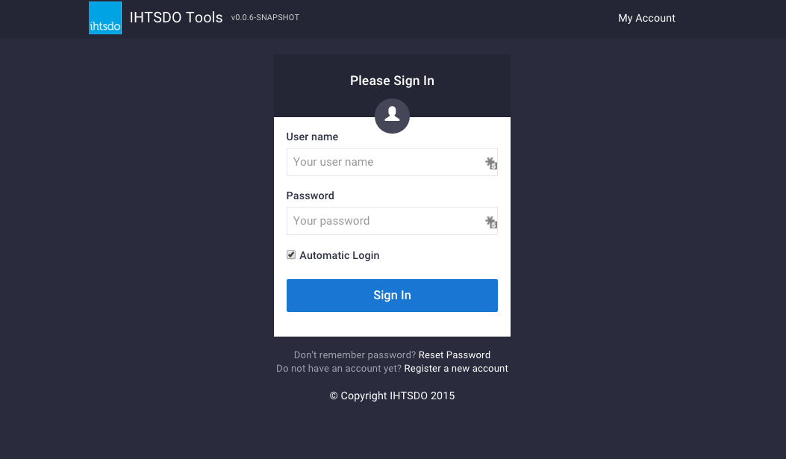

# Accessing CRS

**The International SNOMED CT Content Request Service (CRS) is located here:** [**http://snomed.org/crs**](http://snomed.org/crs)**.**

The US SNOMED CT Content Request Service (USCRS) guide is located in the last pages of this guide: [Broken link](broken-reference "mention")

## System requirements for using CRS & USCRS

In order to use both CRS and USCRS, it is strongly recommended to use Google Chrome and a reliable internet connection. No other software needs to be installed on your computer in order to use CRS.

## Who May Access International CRS?

An authorized requester to the International CRS is usually a named individual from a national release center, a user from a member country who does not have access to a national release center or individuals from international groups who have been identified as providing specialist content.

## How to get into CRS & USCRS?

Both CRS & USCRS uses the Identity Management Service (IMS) to manage credentials. You can use your existing login name and password that you use for Confluence (if applicable). If you do not have account, please follow the instructions below.

If you already have an account to access SNOMED International's Confluence, you will be able to access CRS with your existing account credentials, although you will still need to request access to be able to log in to CRS.

If you do not have an account, or find that you do not have access, please fill in the following form to request access: Confluence User Accounts.

Should you still have any difficulty, please contact us by sending an email to [techsupport@snomed.org](mailto:techsupport@snomed.org).

_Figure 1a_. Once logged in through IMS, you are automatically logged in to the CRS. Choose the CRS from the list of IHTSDO tools and you will be redirected to your CRS dashboard.

<figure><figcaption></figcaption></figure>

Figure 1a

<a href="https://docs.google.com/forms/d/e/1FAIpQLScTmbZIf0UEQwYDkY27EEWBkaiYkHSbR0_9DmFrMLXoQLyL7Q/viewform?usp=pp_url&entry.1767247133=Content+Request+Guide&entry.670899847=Accessing%20CRS" class="button primary">Provide Feedback</a>
