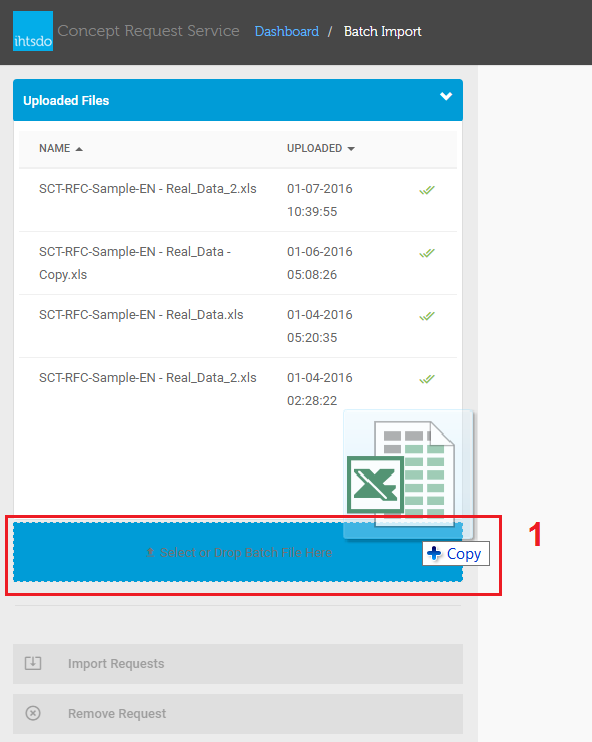
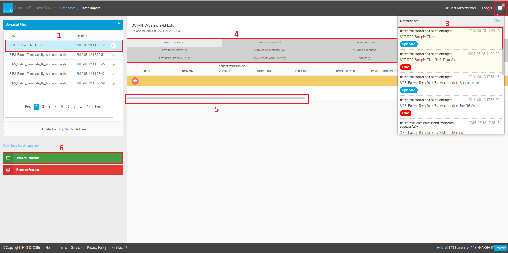
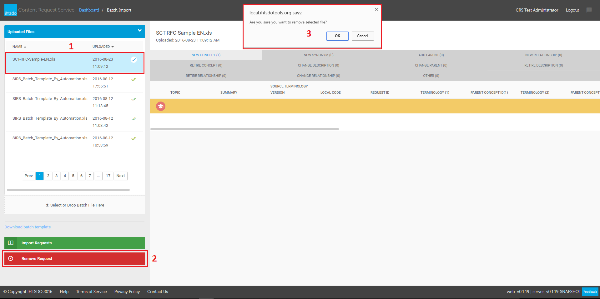
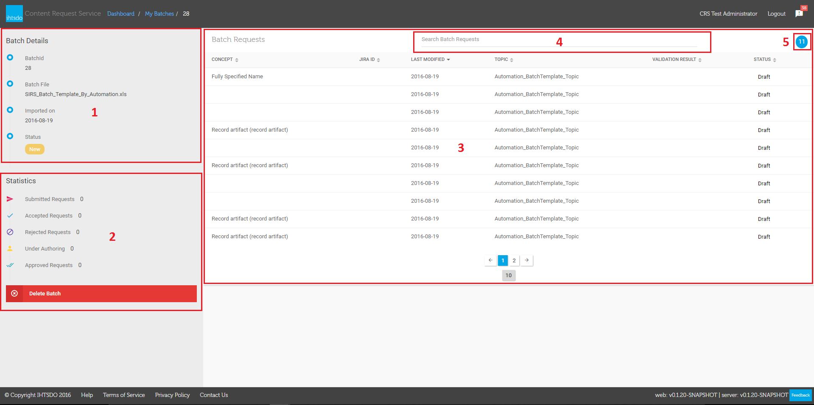
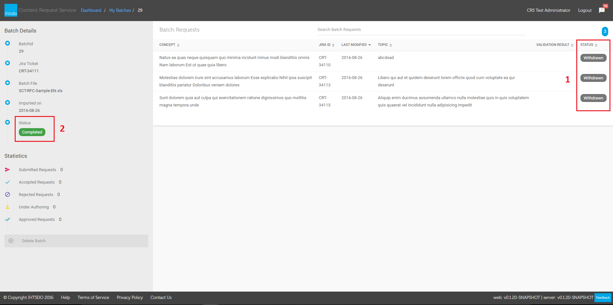
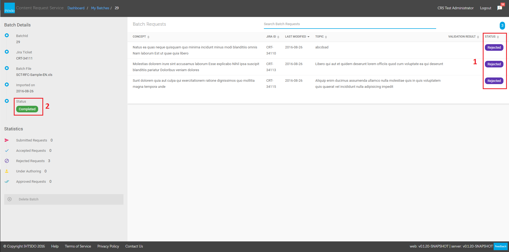
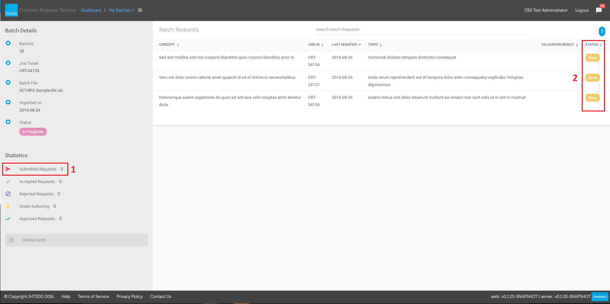
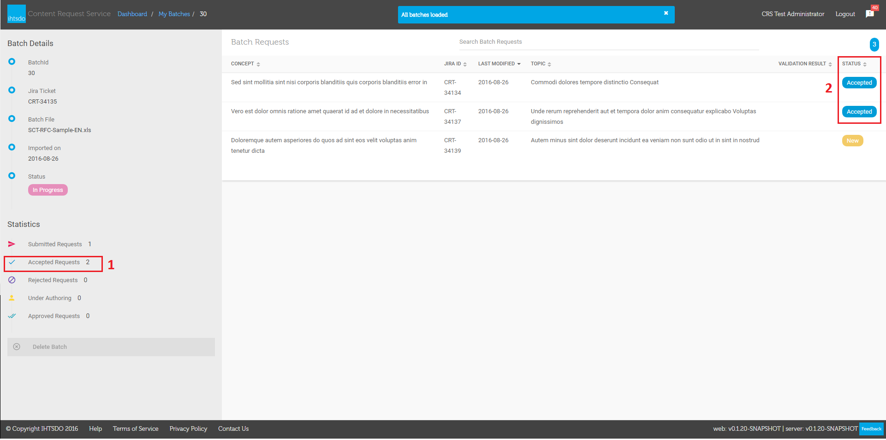
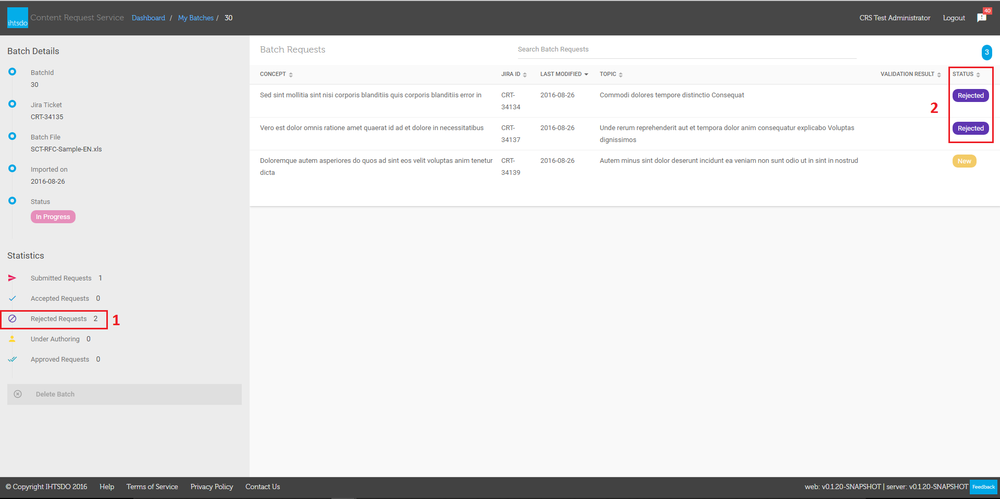

# Create a Batch Request

## Summary

The batch Import function allow to create many requests of all request types through importing file from PC. The imported file will be checked validation before it added into system. All requests in batch is set status to 'Draft' as default.

The information below will give you more details on the operation of this function. Also you can refer and download batch template at link below.

## Where is the Batch Import template located?

The template can be downloaded by selecting the **Download batch template** link from the Batch Import screen. The template is identical to the template you may have previously used on SIRS in order to make transition between the systems as smooth as possible, so you will be able to use any batch requests you have already prepared.

## Importing a New Batch

From CRS Dashboard, select the New Batch Import from the left panel to navigate to the Batch Import screen.&#x20;

\
Files may be uploaded one of two ways:

1. By dragging a file on top of the Drop Batch File Here area **(Figure 2)**
2. Click on area '**Select or Drop Batch File Here** ' (1) to**browsing batch file**(2) from PC. Then click on **button** '**Open'** (3) in dialog to adding the selected file into Uploaded Files list (Figure 3)

<figure><figcaption>
___<em>Figure 3 - Browse File to Import</em>
</figcaption></figure>

The file will be uploaded to **the server** **(1)** and **notify** user once it completed **(2) (3)** , you can select on **each tab (4)** to review your uploaded requests. once you are happy with the file. Move **scrollbar** **(5)** to the right to view more information of batchSelect **Import Request (6)** button to show import statistic (figure 5), and then select on **Import** button to import it to the system. Otherwise, you can delete it if you want.| \_

<figure><figcaption></figcaption></figure>

\
\__Figure 4 - Review Batch File and Import_\
&#xNAN;_&#x44;eleting Batch_ If a batch has been uploaded to CRS but not yet imported, users can delete it in batch uploading screen by following the below instructions:From the Batch Import page, select item in **the Uploaded Files list** (1) and click on **button 'Remove Request'** (2). Then **a dialog with confirmation message**(3) is populated at the top page, click on **button 'OK'** in dialog to delete batch.| \_

<figure><figcaption></figcaption></figure>

\_**Figure 6: Deleting batch**

## Viewing Batches

From CRS Dashboard, select on **My Batch Requests** (1) from the left panel to navigate to **the My batches page** (2).Click on **button 'Import Batch'** (3) to navigate to Batch Import page (Figure 1)_._|

\|---\
Select on a batch row to go to **batch request details,** with **Batch Details (1), Statistics (2), Batch Requests (3), Searching batch (4) and Number of requests (5)** in batch as shown in the screenshot below.|

<figure><figcaption></figcaption></figure>

_Figure 8 - Batch Details page_

## Batch status

From My Batches page, select a New Batch in list to navigate to batch details. The batch status set to **'New' (1)** when all requests in batch is in **Draft status (2)**|\
From Batch Details page, try to submit a request in list. And then refresh this page, Submitted request is changed to **'New' status (1)** and the batch status is changed from 'New' to **'In Progress'(2)**. Status 'In Progress' is displayed only when a request in list is submitted.|\
From Batch Details page, change status all requests in list to **Completed or Withdrawn or Reject or all three (1)**. And then refresh this page , the**batch status** is changed from 'In-Progress' to **'Completed' (2).**|\

<figure><figcaption></figcaption></figure>

\__Figure 11.2 - Batch in status 'Completed'_\

<figure><figcaption></figcaption></figure>

\__Figure 11.3 - Batch in status 'Completed'_\

Batch Statistics

From Batch Details page, **Submitted Requests number (1)** is updated after requests are changed status to **'New'** **(2)**. .&#x20;

<figure><figcaption>
---|---
</figcaption></figure>

_Figure 12 - Submitted Requests Number_\
From Batch Details page, **Accepted Requests number (1)** is updated after requests are changed status to **'Accepted'** **(2)**.&#x20;

<figure><figcaption></figcaption></figure>

_Figure 13 - Accepted Requests Number_\
From Batch Details page, **Rejected Requests number (1)** is updated after requests are changed status to **'Rejected'** **(2)**.&#x20;

<figure><figcaption></figcaption></figure>

_Figure 13 - Rejected Requests Number_

## Deleting in Batch Details

From My Batches page, select a New Batch in list to navigate to batch details. And click on button **'Delete Batch' (1)** button, the **confirmation dialog (2)** is populated at the top, then click on button 'OK' to confirm deleting batch.

<a href="https://docs.google.com/forms/d/e/1FAIpQLScTmbZIf0UEQwYDkY27EEWBkaiYkHSbR0_9DmFrMLXoQLyL7Q/viewform?usp=pp_url&entry.1767247133=Content+Request+Guide&entry.670899847=Create%20a%20Batch%20Request" class="button primary">Provide Feedback</a>
