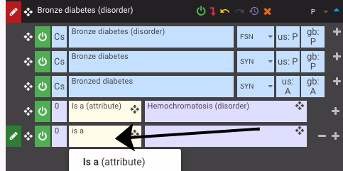

# Using Type Ahead Within CRS

### Using Type Ahead to Locate Concepts or Relationships

| Steps                                                                                                                                                                                                                                                                                                    | Reference                                                                                         |
| -------------------------------------------------------------------------------------------------------------------------------------------------------------------------------------------------------------------------------------------------------------------------------------------------------- | ------------------------------------------------------------------------------------------------- |
| Within CRS there may be times where you need to enter in a Concept or Relationship manually. The system will attempt to guess the concept you are looking for by using typeahead. To use, simply enter more then 3 characters to begin searching. Narrow the search results by entering more characters. | 
<figure><figcaption></figcaption></figure>
 |
| This is also applicable for concepts and relationships in Direct Mode                                                                                                                                                                                                                                    | 
<figure><figcaption></figcaption></figure>
 |

<a href="https://docs.google.com/forms/d/e/1FAIpQLScTmbZIf0UEQwYDkY27EEWBkaiYkHSbR0_9DmFrMLXoQLyL7Q/viewform?usp=pp_url&entry.1767247133=Content+Request+Guide&entry.670899847=Using%20Type%20Ahead%20Within%20CRS" class="button primary">Provide Feedback</a>
