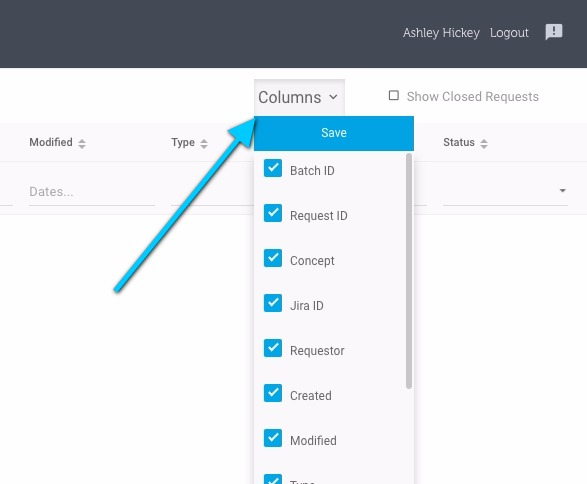

# Customizing the list view screen

| Steps                                                                                                                  | Reference                                                                                                                                                                                                                                                                                                   |
| ---------------------------------------------------------------------------------------------------------------------- | ----------------------------------------------------------------------------------------------------------------------------------------------------------------------------------------------------------------------------------------------------------------------------------------------------------- |
| To hide/show any column on a list view screen select the, **Columns** button on the upper right portion of the screen. | 
<figure><figcaption>
A drop down list of all table columns will appear. From this list select (or unselect to hide) to hide show / the desired columns. Select the <strong>Save</strong> button to confirm your selections.
</figcaption></figure>
 |
| The UI will indicate that the columns have been saved.                                                                 | 
<figure><figcaption></figcaption></figure>
                                                                                                                                                                                                              |
