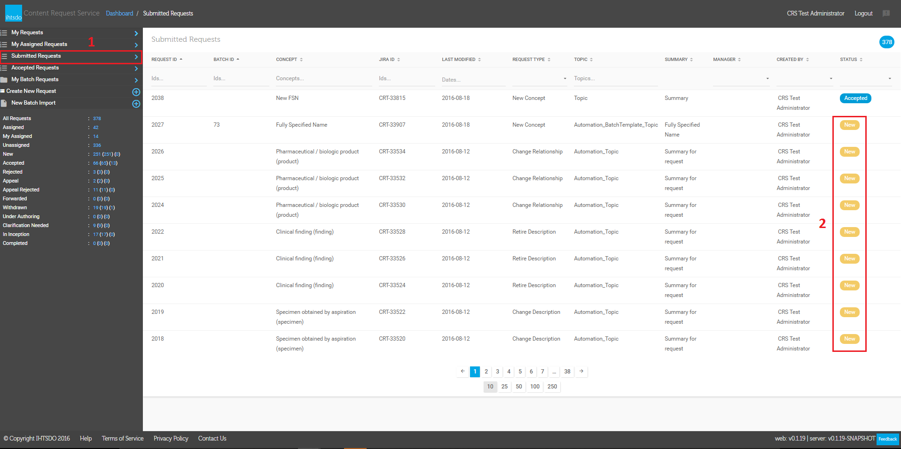
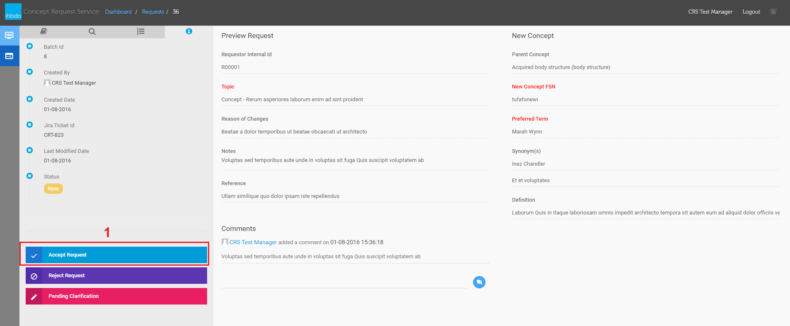
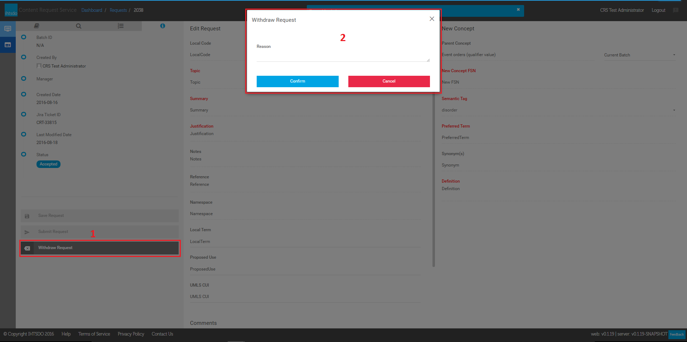

# Managing Submitted Requests Screen

Audience

Applicable to users responsible for managing content requests. See also: [SIRS to CRS Status Map](../../SIRS-to-CRS-Status-Map_31985160.html) for task status meaning

## Accept Request

From **CRS Dashboard** , in **Submitted Requests (1)** , select a request which has status is **New (2)** to go to request details page.|

<figure><figcaption></figcaption></figure>

_Figure 1: The Submitted Requests screen_ select **Accept Request** (1) button to accept a request, then you will be redirected to **CRS Dashboard**

<figure><figcaption></figcaption></figure>

## Reject Request

From **CRS Dashboard** , in **Submitted Requests** (Figure 1), select a request which has status is **New** to go to request details page.select **Reject Request** (1) button and provide a reason and select Confirm button **in Reject Request dialog (2)** to reject a request, you will be redirected to **CRS Dashboard.**|

## Clarification Requested

From **CRS Dashboard** , in **Submitted Requests** (Figure 1), select a request which has status is **New** to go to request details page.Select **Pending Clarification** (1), to launch the , **Pending Clarification dialog** (2). Enter a **Reason** (what clarification is desired on) and select **Confirm** , you will be redirected to **CRS Dashboard.**|

## Appeal Rejected Request

From **CRS Dashboard** , in **My Requests** , select a **rejected** request to go to request details page.select **Appeal Rejection** (1) button to appeal a request, then provide a reason and select Confirm button in **the Appeal Request Rejection** (2) you will be redirected to **CRS Dashboard.**|

## Withdraw Request

From **CRS Dashboard** , in **My Requests** , select a **Accepted** request to go to request details pageSelect **Withdraw Request** (1), to launch the **Withdraw Request** dialog (2). Provide a reason and select **Confirm** , then you will be redirected to **CRS Dashboard.**|

<figure><figcaption></figcaption></figure>

\
