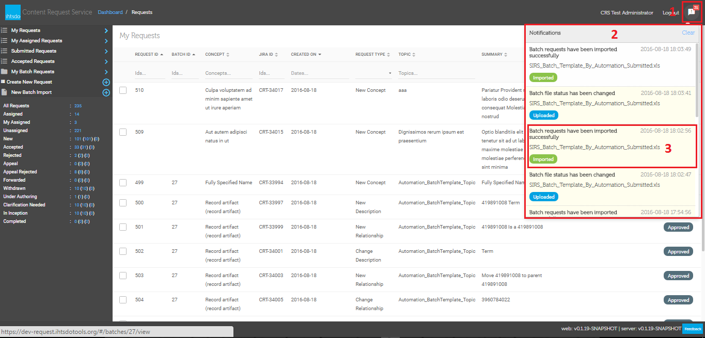

# Notifications

If there is any change which related to your submitted requests such as status changed, new comment added, batch importing completed, then CRS will inform you via its notification feature.

from any page of CRS you will see the icon

<figure><figcaption>
at the very top right of the page, the number of new notifications shall be displayed as number which next to the icon. you can click on <strong>the icon</strong> (1)to see <strong>the list of notifications</strong> (2) and click on <strong>each message</strong> (3) to go to request details or batch details.
</figcaption></figure>

\_\_\*\*

<figure><figcaption>
**__
</figcaption></figure>

### Notes:

CRS will only notify a user about new comments/feedback/questions/answers added if it provided in CRS. For comments which come from out side of CRS such as JIRA, theuser will not get any notification. Please note this is in addition to email notifications. The system will also send an email notification for new comments, feedback, and Q\&A.

<a href="https://docs.google.com/forms/d/e/1FAIpQLScTmbZIf0UEQwYDkY27EEWBkaiYkHSbR0_9DmFrMLXoQLyL7Q/viewform?usp=pp_url&entry.1767247133=Content+Request+Guide&entry.670899847=Notifications" class="button primary">Provide Feedback</a>
