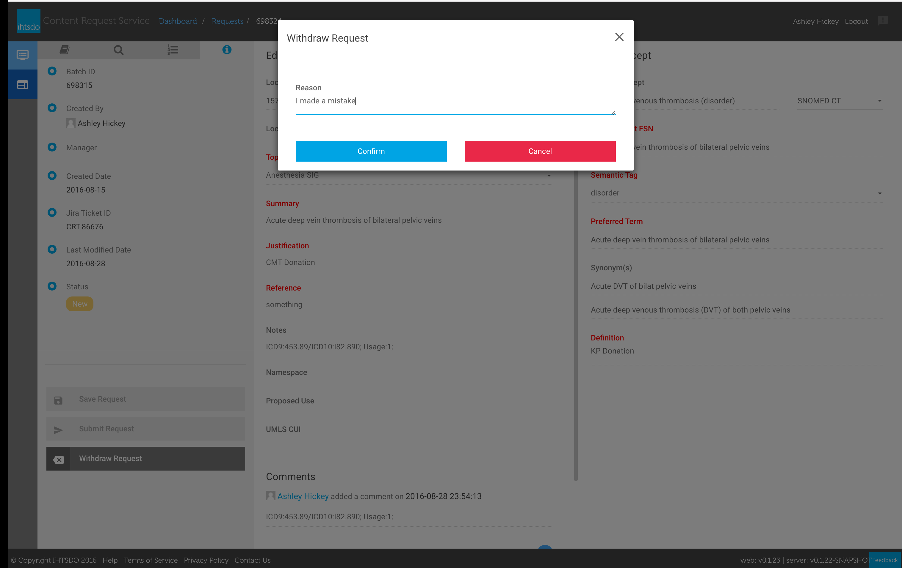

# Withdrawing a Submitted Request

| Steps                                                                                                                                                                                                                                                                                                                     | Reference                                                                                      |
| ------------------------------------------------------------------------------------------------------------------------------------------------------------------------------------------------------------------------------------------------------------------------------------------------------------------------- | ---------------------------------------------------------------------------------------------- |
| 1 - Select a request from the dashboard to load the**Edit Request** screen.2 - To withdraw the request select **Withdraw Request** (A) from the **Request Info** panel. This will load the Withdraw Request dialog.                                                                                                       | 
<figure><figcaption></figcaption></figure>
 |
| 3 - From the Withdraw request dialog, enter a reason for withdrawing the request and select **Confirm.** The system will indicate that it is processing the request. Once completed you will be redirected to the dashboard and the status will be in the **Withdrawn** status and the request will be considered closed. | 
<figure><figcaption></figcaption></figure>
 |
