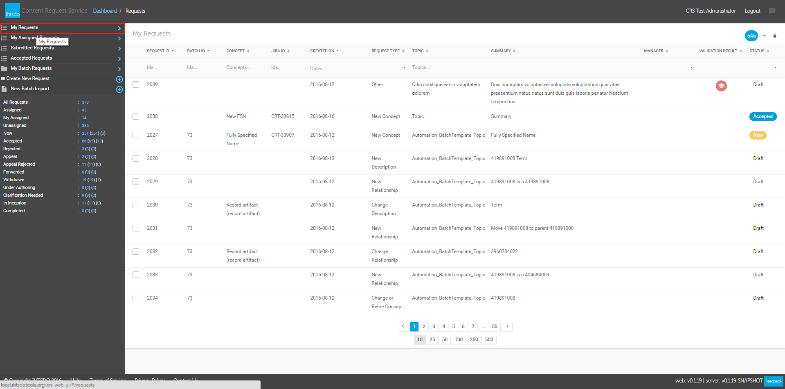
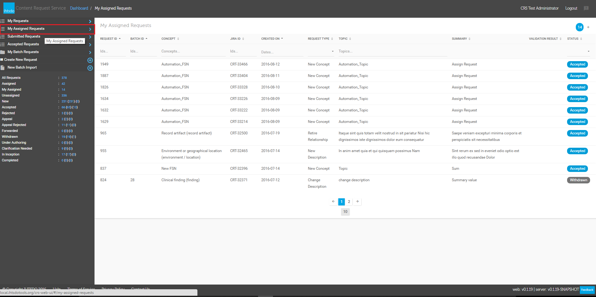
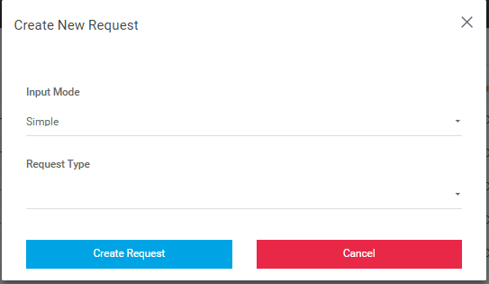

# Navigating CRS from the Sidebar

|   
---|---  
  
## What are **My Requests**?

These are the requests that the current user has submitted. From this dashboard as user may view their own requests and track their progress through evaluation and, if accepted, eventual inclusion into SNOMED CT.| <figure></figure>  
  
## What are **My Assigned Requests**?

These are the requests that the current user has been assigned. From this dashboard as user can view their assigned requests and update request in to CRS and SNOMED CT.| <figure></figure>  
  
## What are **Submitted Requests** ?

Users may search requests from other users to identify similar or identical requests.| <figure></figure>  
  
## What are **Accepted Requests**? :

Following initial review, each request is assigned a manager who is a member of the IHTSDO Content Team. A change to a status of “Accepted in scope” does not mean that the request will be approved for inclusion in SNOMED CT.| <figure></figure>  
  
## What are **My Batch Requests**?

Refers to Content Requests for a large scale addition of new content/ and or large scale modifications to existing content.| <figure></figure>  
  
## What is **Create New Request**?

Allows a user to create a Content Request in simple or direct mode| <figure></figure>  
  
## What is **New Batch Import**?

Allows a user to create a request for large numbers of new content adaptations or modifications by uploading content.| <figure><figcaption>
_
</figcaption></figure>  
  
_

**  
**
