# New Features & Improvements - January 2017

This page provides some useful guides on how to use the new functionality available v1.1.11 of CRS deployed in January 2017. More details on what was in the release can be found on the [January 2017 Release Notes](https://confluence.ihtsdotools.org/display/SCTCR/January+2017+Release+Notes).

## Request Lists:

### Highlighted list menu

  * CRS will now highlight the current request list that the current user is viewing
  * <figure>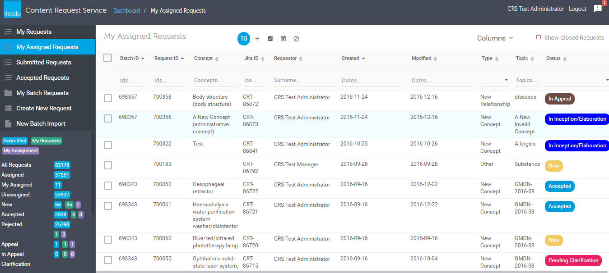</figure>

### Default selected list

After login to CRS, CRS will select the default request list based on the current user role:

  * If the current user is a requestor, the default selected list will be "My Requests". 
  * If the current user is a manager, the default selected list will be "My Assigned Requests".
  * If the current user only has view permision, the default selected list will be "Submitted Requests". 

### Show/Hide Columns

In all of the requests lists (My Requests, My Assigned Requests, Submitted Requests, Accepted Requests), users can select what columns to show or hide by following the below steps:

  * Click on the "Columns" button on any list, a drop down will be shown
  * Tick a column name that should be shown, untick a column name to hide it
  * Click on "Save" button on top of the drop down, the settings will be saved and the next times the user use that list, the settings will be applied automatically

Each list has its own columns settings, configuration on one list will not affect another list. If user want to apply the settings to all the list, they have to updated all the configuration on all of the list

<figure>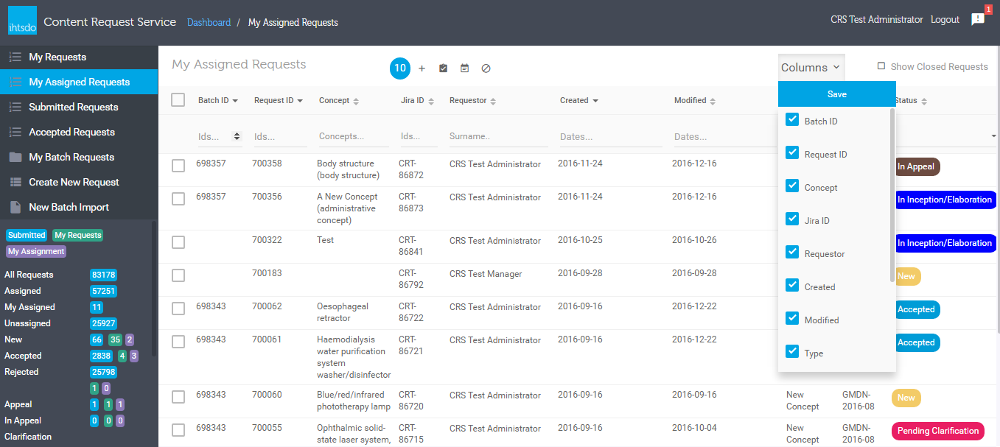</figure>

## New Bulk Actions

### Withdraw requests

Requestors can withdraw multiple requests at the same time by following the below steps:

  * Open "My Requests" list
  * Tick the requests that will be withdrawn
  * Click on "Withdraw Request(s) button on top of the list
  * When a dialog is displayed, typed in the reason, click "Confirm", the reason will be added to all the selected request

After CRS finishing updated the selected requests, the results will be displayed

<figure>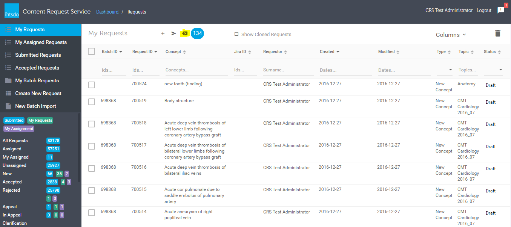</figure>

### Reject requests

Managers can reject multiple requests at the same time by following the below steps:

  * Open "My Assigned Requests" or "Submitted Requests" or "Accepted Requests"
  * Tick the requests that will be rejected
  * Click on "Reject Selected Requests" button on top of the list
  * When a dialog is displayed, typed in the reason, click "Confirm", the reason will be added to all the selected request

After CRS finishing updated the selected requests, the results will be displayed

<figure>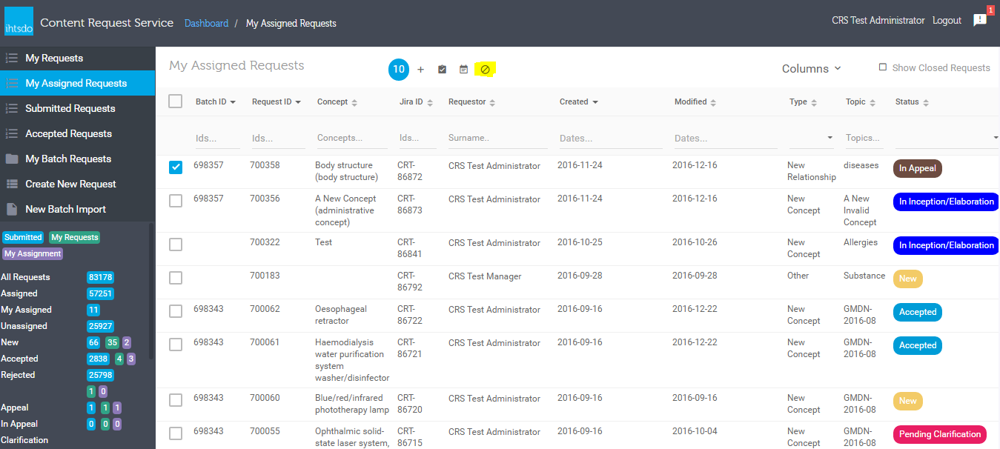</figure>

## Request Details:

### Get Next Request

If users open requests details from any of the request list (My Requests, My Assigned Requests, Submitted Requests, Accepted Requests), users can traverse the selected list without going back to the list view by using the "Next Request" button on the left panel of the form

This button is only enabled if the request details form is opened by from the request list, if users access this form by opening the links, this button won't be enabled

<figure>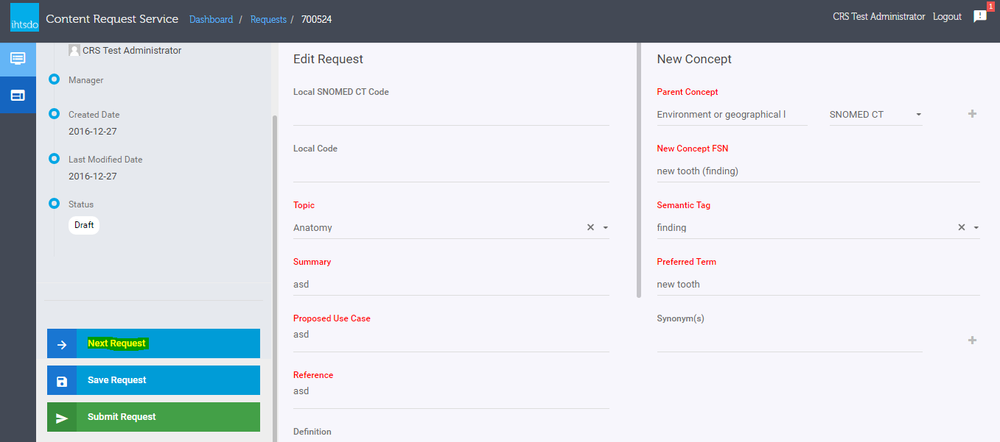</figure>

### Appeal Clarification

Managers can ask for clarification for appeals from requestors by using the "In Appeal Clarification" button on the left panel in the request details form. This action will update the status of the request to "In Appeal Clarification"

<figure>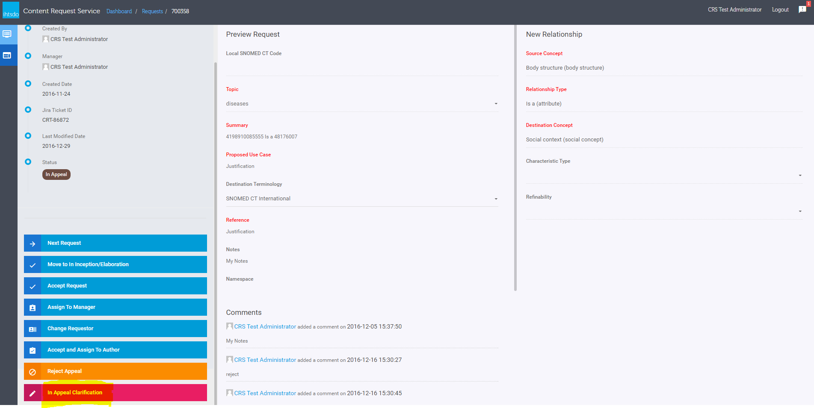<figcaption>
If the request status is "In Appeal Clarification", managers can decide to reject or accept the appeals
</figcaption></figure>

<figure>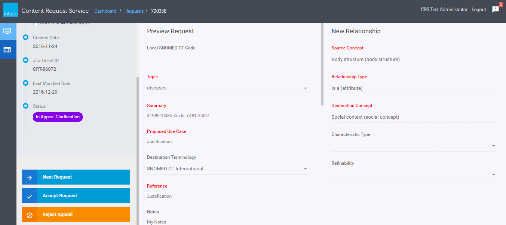</figure>

### Change Requestor

Managers can update the requestor of requests after submission by using the "Change Requestor" button on the left panel of request details form. This button is NOT available if managers open the request from "My Request" list.

<figure>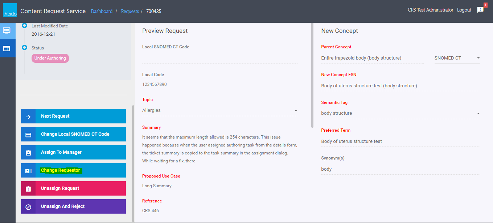</figure>

### Change Local SNOMED CT Code

Managers can update the "New Concept" request's "Local SNOMED CT Code" after submission by using the "Change Local SNOMED CT Code" from the left panel

<figure>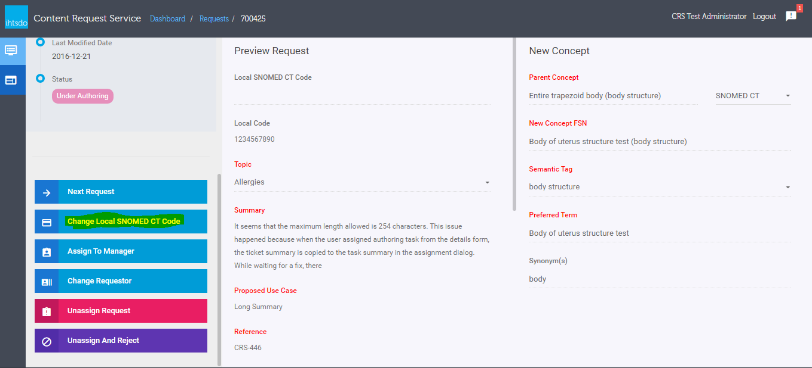</figure>

### New Concept Validations

The validation for "New Concept" requests has been updated wth 2 new checks:

**Local SNOMED CT Code format check:** if user input value into "Local SNOMED CT Code" field, CRS will check the input value with CIS to validate and return the result. If CRS returns an error, the value must be updated to meat SCT ID validation rules

<figure>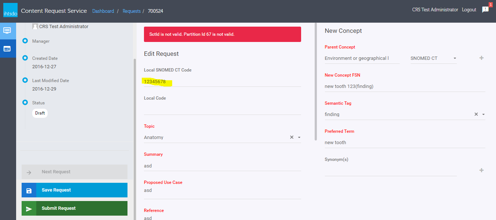<figcaption>
<strong>Duplication FSN Check</strong> : when requestors submit "New Concept" request, the "New Concept FSN" will be validated against terminology server and current requests on CRS. If there is error, a message will be displayed and list out the duplication concept or CRS request.
</figcaption></figure>

Clicking on the duplicated concept ID or request ID on the error message will open a new tab on browser to display the duplicated concept or request details

<figure>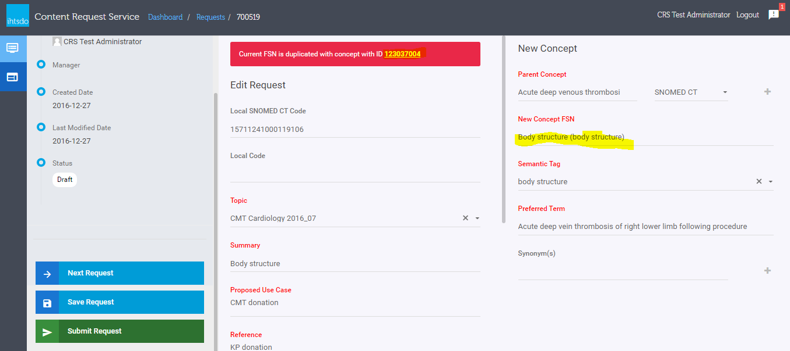</figure>

<figure>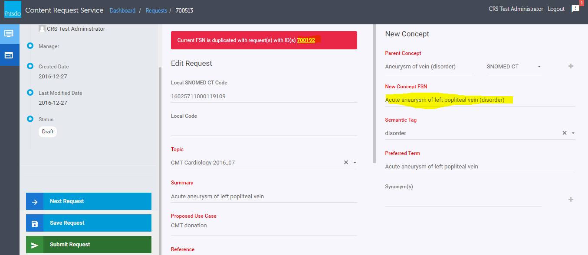</figure>

### Batch Import

Delete an imported batch file: Requestors can delete one or multiple imported batch file by selecting the batch files and click on "Remove Files" button

<figure>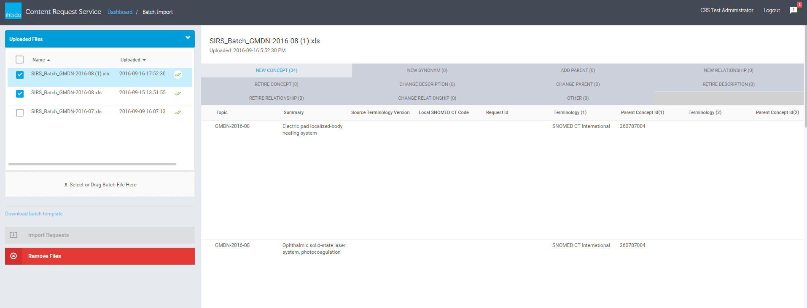</figure>

### Updating new concept release information

When releasing new concept, external services can update release information on CRS by using a REST API documented in: <https://uat-request.ihtsdotools.org/ihtsdo-crs/swagger-ui.html#!/request-apis/updateReleaseInfoUsingPUT>. After submission, the information can be updated at any state of the request. After updating, the information will be shown in the request details form

<figure></figure>

  
  
  

