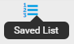
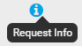
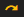
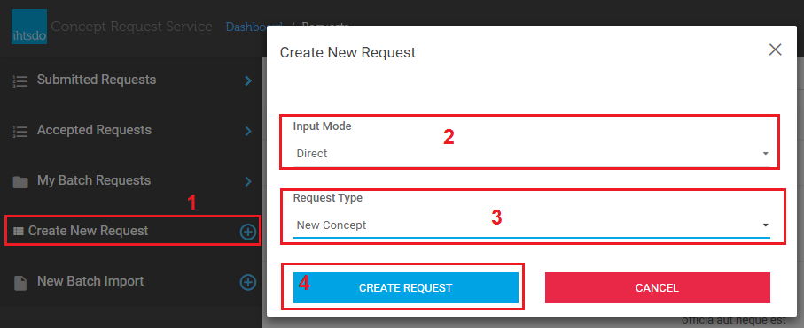
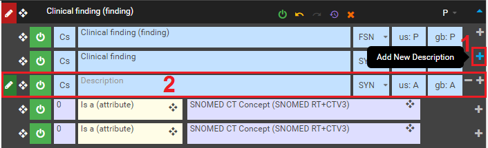
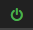
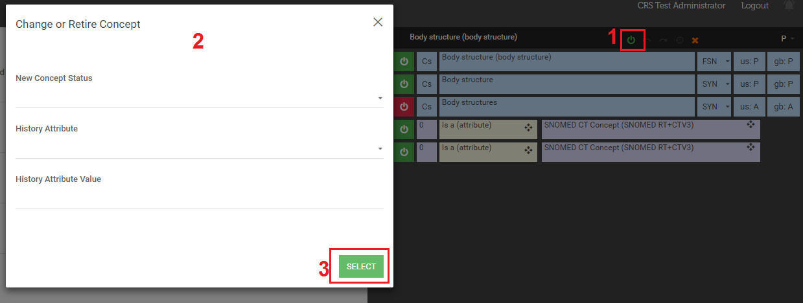
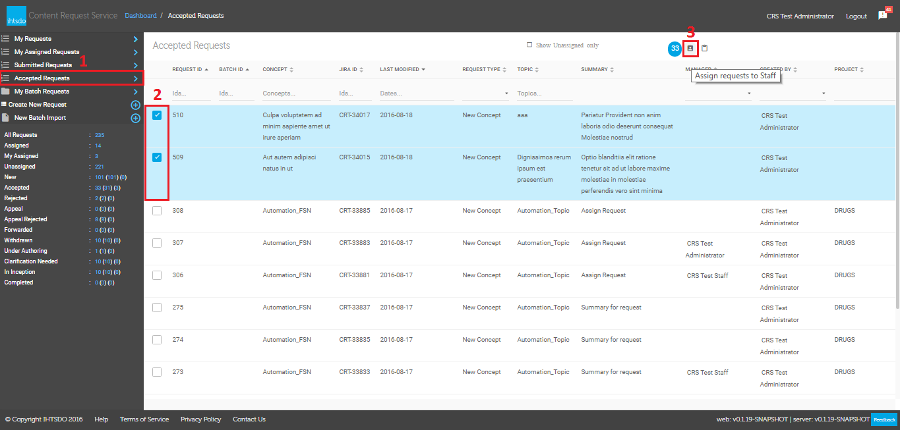
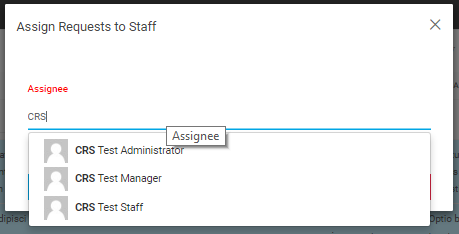
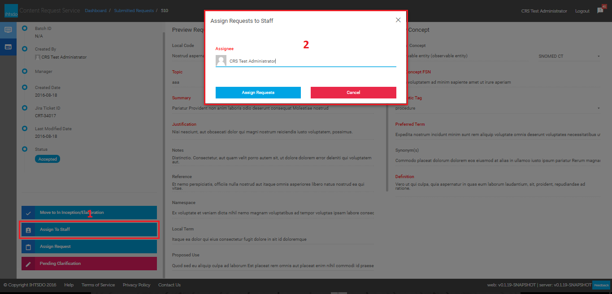

# Printable Version

## What is the SNOMED CT Content Request Service (CRS)?

This tool allows users to request modify or make additions to SNOMED CT.

## How do I get to CRS?

Please go to <https://request.ihtsdotools.org> or <http://snomed.org/crs>, where you will be asked to log in.

## How do I obtain a CRS Account?

Please see, [Accessing CRS](https://confluence.ihtsdotools.org/display/SCTCR/Accessing+CRS).

## Is there any quick introduction?

Yes. (_and the screen is purposefully blank for a few minutes.._)

## What type of content requests can I make?

Before making any request, please read the guidance on submitting content -

[Version 15.0 Customer Guidance for Requesting Changes to SNOMED CT 20240723.pdf](attachments/22318960/245794146.pdf)  

Users able to create requests to add, modify or retire information in SNOMED CT including:

  * Creating a new Concept(s)
  * New Synonym(s)
  * Add Parent(s)
  * Modify Description(s)
  * Modify Parent(s)
  * Modify Relationship(s)
  * New Relationship(s)
  * Retire Concept(s)
  * Retire Description(s)
  * Retire Relationship(s)
  * Other: 
    * Request for new attributes to be introduced
    * Request for existing attributes to be removed
    * Request for existing Refsets to be amended (new members or changes)
    * Request for enhancement (clean-up) of areas of SNOMED CT
    * Request for changes to the concept model
    * Changes to editorial policy statements
    * Changes to text definitions (e.g. "surgical procedure")
    * Request for Quality initiative to address specific quality issues within the Terminology

## How are Requests Prioritized?

All requests are treated as normal priority with the exception of data errors. Where a request points towards a possible error in SNOMED CT, the request will be prioritized for investigation.

## How do I submit a request? 

There are three methods of creating requests for SNOMED Content: [Simple Mode](https://confluence.ihtsdotools.org/display/SCTCR/Create+A+Request+in+Simple+Mode), [Direct Mode](https://confluence.ihtsdotools.org/display/SCTCR/Create+A+Request+in+Direct+Mode), and [Batch Mode](https://confluence.ihtsdotools.org/display/SCTCR/Create+a+Batch+Request). To learn more about these modes and help choosing the correct one see: [Creating Requests](https://confluence.ihtsdotools.org/display/SCTCR/Creating+Requests)

## Can I save my Content Request and return to it later for completion?

Users may exit the system for later completion, validation, and submission.

## Can I modify my Request once it is submitted?

As an requestor you can do a number of things on each request -  [Managing Submitted Requests Screen](https://confluence.ihtsdotools.org/display/SCTCR/Managing+Submitted+Requests+Screen)

  

**Page at a glance**

** **

**  
**

**  
**

**  
**

**Further Information**

  * [Getting Started](https://confluence.ihtsdotools.org/display/SCTCR/Getting+Started)
  * [New Features & Improvements - January 2017](https://confluence.ihtsdotools.org/pages/viewpage.action?pageId=35987303)
  * [Accessing CRS](https://confluence.ihtsdotools.org/display/SCTCR/Accessing+CRS)
  * [Navigating CRS from the Sidebar](https://confluence.ihtsdotools.org/display/SCTCR/Navigating+CRS+from+the+Sidebar)
  * [Creating Requests](https://confluence.ihtsdotools.org/display/SCTCR/Creating+Requests)
  * [What happens after my request is submitted?](https://confluence.ihtsdotools.org/pages/viewpage.action?pageId=31033247)
  * [Managing Submitted Requests Screen](https://confluence.ihtsdotools.org/display/SCTCR/Managing+Submitted+Requests+Screen)
  * [Reassign Request](https://confluence.ihtsdotools.org/display/SCTCR/Reassign+Request)
  * [Notifications](https://confluence.ihtsdotools.org/display/SCTCR/Notifications)
  * [Withdrawing a Submitted Request](https://confluence.ihtsdotools.org/display/SCTCR/Withdrawing+a+Submitted+Request)
  * [End to End Work Flow - Simple Mode](https://confluence.ihtsdotools.org/display/SCTCR/End+to+End+Work+Flow+-+Simple+Mode)
  * [CRS Workflow](https://confluence.ihtsdotools.org/display/SCTCR/CRS+Workflow)
  * [Content Request Glossary](https://confluence.ihtsdotools.org/display/SCTCR/Content+Request+Glossary)
  * [Displaced Comment (internal only)](https://confluence.ihtsdotools.org/pages/viewpage.action?pageId=31983487)
  * [Demonstration Videos](https://confluence.ihtsdotools.org/display/SCTCR/Demonstration+Videos)
  * [SIRS to CRS Status Map](https://confluence.ihtsdotools.org/display/SCTCR/SIRS+to+CRS+Status+Map)
  * [My CRS Reports](https://confluence.ihtsdotools.org/display/SCTCR/My+CRS+Reports)
  * [Printable Version](https://confluence.ihtsdotools.org/display/SCTCR/Printable+Version)
  * [Customizing the list view screen](https://confluence.ihtsdotools.org/display/SCTCR/Customizing+the+list+view+screen)
  * [Batch Template Changes](https://confluence.ihtsdotools.org/display/SCTCR/Batch+Template+Changes)

### Request Status Glossary

CRS Status| Description| PreviousSIRS Status  
---|---|---  
**Draft**|  A request that has been started and saved but not yet submitted.| _Draft_  
**New**|  All submissions (excluding draft) are initially assigned a status of New. A preliminary check will be carried out to ensure that the new request falls within the inclusion criteria and scope for the International Edition of SNOMED CT before the request will be progressed.| _New_  
**Accepted**|  Following initial review, each request is assigned to a member of the Content Team. A change to a status of ‘Accepted’ does not mean that the request will be approved for inclusion in SNOMED CT.| _Approved_ _& Accepted In Scope_  
**Under Authoring**|  A member of the Content Team is actively evaluating the request.| _Construction_  
**In Inception**|  Where a new request aligns with an ongoing content project, the request will be placed into this status until editorial policy is available to support the requested change or addition. Content projects are intended to investigate issues or enhancements to both existing and future content for SNOMED CT. A process for understanding the problem and elaboration of a solution is undertaken in order to make improvements to existing content and clarify how content of a similar nature will be incorporated into SNOMED CT in the future. Depending upon the nature of the content project, this may be a longterm large-scale content project or a smaller project with a shorter timescale.| _Awaiting policy_  
**Clarification Needed**|  Where insufficient information is provided to proceed with a request, a member of the Content Team will incorporate questions to be resolved and change the status of the request to ‘Clarification Needed’. This will generate an email to the original requester. Where a request for clarification to a customer is not answered within **60 days** from the date the clarification is generated, the request will be marked as rejected.| _Clarification requested_  
**Forwarded**|  Where a request is received that is not in scope for the International Edition of SNOMED CT, it may be suitable for a specific extension. The request may be marked as forwarded to denote that it has been handed over to another extension manager or National Release Center.| _Forwarded_  
**Withdrawn**|  Once submitted, a request cannot be deleted but can be "Withdrawn" by the original requestor.| _Withdrawn_  
**In Appeal**|  Where a request has been “Not Accepted”, the submitter may request a further review of the decision. The submitter can then place the request in “In Appeal” status. In these circumstances the decision will be reviewed and if necessary referred to the Head of Terminology for final disposition.| _Appeal_  
**Appeal Rejected**|  After conclusion of the appropriate appeal process, where the outcome remains unchanged, this status will be applied.| _Appeal Rejected_  
**Rejected**|  Where a request has had a full review and is not considered to be in scope for SNOMED CT, or does not meet the criteria outlined in the Editorial Guide, or clarification about the request has not been received within 60 days it will be rejected.| _Rejected_  
**Ready For Release**|  The requested change has been made and approved, however this status does not assure that the requested change will be included in the final release data.| _Construction_  
**Completed**|  A request status will be changed to "Completed" once the SNOMED CT International Edition, in which the request has been addressed, has been released.| _Completed_  
  
|   
---|---  
  
## What are **My Requests**?

These are the requests that the current user has submitted. From this dashboard as user may view their own requests and track their progress through evaluation and, if accepted, eventual inclusion into SNOMED CT.| <figure></figure>  
  
## What are **My Assigned Requests**?

These are the requests that the current user has been assigned. From this dashboard as user can view their assigned requests and update request in to CRS and SNOMED CT.| <figure></figure>  
  
## What are **Submitted Requests** ?

Users may search requests from other users to identify similar or identical requests.| <figure></figure>  
  
## What are **Accepted Requests**? :

Following initial review, each request is assigned a manager who is a member of the IHTSDO Content Team. A change to a status of “Accepted in scope” does not mean that the request will be approved for inclusion in SNOMED CT.| <figure></figure>  
  
## What are **My Batch Requests**?

Refers to Content Requests for a large scale addition of new content/ and or large scale modifications to existing content.| <figure></figure>  
  
## What is **Create New Request**?

Allows a user to create a Content Request in simple or direct mode| <figure></figure>  
  
## What is **New Batch Import**?

Allows a user to create a request for large numbers of new content adaptations or modifications by uploading content.| <figure><figcaption>
_
</figcaption></figure>  
  
_

**  
**

## What mode should I use?

  

Task| Simple| Direct| Batch Import  
---|---|---|---  
Modify, retire, or, create a single Concept| **x**| **n/a**| **x**  
Make more than one change to an existing Concept|   
| **n/a**| **x**  
Retire more than one more component to an existing Concept|   
| **n/a**|   
  
  
## What is Simple mode used for?

In **Simple Mode** , a user can create a request to perform a single action on one concept:

  * create a new Concept
  * Add a new Description to an existing concept 
  * Add a new Relationship to an existing concept 
  * Modify an existing Description of an existing concept 
  * Change a Relationship of an existing concept 
  * Retire a Description of an existing concept 
  * Retire Relationship of an existing concept 
  * Change or Retire an existing Concept 
  * Other - all requests not covered by the above types

## What was Direct mode used for?

**D****irect Mode** has previously been available, but since the inclusion of axioms to SNOMED CT, we cannot guarantee that this mode will works as expected. **It is therefore not a recommended approach to use and that option has been removed from CRS until further notice. **

## What is Batch mode used for?

In **Batch Mode** , a user can create a request to perform a multiple (typically) related actions

  

## Form Fields

In each of the Simple and Direct modes, there are certain fields which are mandatory and need to be completed on each request:

Field| Description| Mandatory| Notes  
---|---|---|---  
Topic| From the dropdown, choose the relevant area/domain for the request| Y|   
  
Summary| Provide a short summary which will help staff identify and triage the request| Y|  _Please note this field has a 255 character limit_  
Proposed Use Case| Provide justification on why the content should be added or changed| Y|   
  
Reference| Provide references which can be verified to confirm the need to add or change the content| Y|   
  
Local SNOMED CT Code| Add the local valid SNOMED CT identifier of the content to be added if one exists|   
|   
  
Local Code| Add any other local code identifiers for your own reference|   
|   
  
Definition| Precise meaning of the requested content addition or change|   
|   
  
Notes| Any extra notes which will help the triage of the request|   
|   
  
Namespace| Add the namespace of the content, if applicable|   
|   
  
UMLS CUI| Add the UMLS Concept Unique Identifier if one exists|   
|   
  
Originating Organization| Choose the organization from the drop down that is requesting the change or addition| Y|  _International CRS only_  
Collaboration Agreement| If relevant, select the collaboration agreement under which the request is being made|   
|  _International CRS only_  
  
Summary

In **Simple mode** , user can create more types request as **'New Concept'** , **'New Description'** , **'New Relationship'** , **'Change Description'** , **'Change Relationship'** , **'Retire Description'** , **'Retire Relationship'** , **'Change or Retire Concept'** or **'Other'** . In this mode, user is provided an easy user interface to use. As well as Direct mode, new request will be added into the My Request list in status **Draft** or**New** after user saved or submitted request. 

## Dashboard

From **CRS Dashboard** (Figure 1), click on **Create New Request** (1), select **Simple** (2) from **Input Mode**|  <figure><figcaption>
---|---
</figcaption></figure>_Figure 2 - Select Simple Mode_  
  
## New Concept

**Select**New Concept** (3) from drop-down list **Request Type** and click **Create Request** (4) **| <figure><figcaption>
---|---
</figcaption></figure>_Figure 3 - Select New Concept Type_  
Select tab **Taxonomy** (1), **Search** or **Saved List** from the left panel to select a desire concept to drag & drop to **Parent Concept** (3) field. And then **Source Terminology**(4) is set automatically to **SNOMED CT.** But if this request is opened from Batch Requests, **Terminology Suggestion**(4) is set to**Current Batch.**|  <figure></figure>_Figure 4 - Compose a New Concept_  
If you want to add more Parent Concept, click on the **plus** icon <figure></figure> on each Parent Concept (1) to add.If you want to remove a Parent Concept, click on the **minus** icon <figure></figure> on each Parent Concept (1) to remove.| <figure></figure>_Figure 4.1 - Add/Remove Parent Concept_  
If you want to add more **Synonyms** , click on the plus icon <figure></figure> on each synonym (1) to add. if you want to remove a synonym, click on <figure></figure> button on each synonym to remove. do the same with **Definition**(2).| _<figure></figure>__Figure 5 - Add More Synonyms and Definitions_  
Select tab **Request Info** (1) to **save**(2) the request with **Draft** status which allows you to edit request details before submit, or **submit** (3) the request to manager/staff. Request details editing is locked after submitted.| _<figure></figure>__Figure 6 - Save or Submit Request_  
  
## New Description

Select **New Description** from **Request Type** drop-down list and click **Create Request** button (Figure 7)| <figure><figcaption>
---|---
</figcaption></figure>_Figure 7 - Select New Description_  
Search or browse for a desire concept from **the left panel** (1) to drag & drop it into **Concept** field (2), enter request details to Save or Submit the request (Figure 6).| <figure></figure>_Figure 8 - Compose a New Description_  
  
## New Relationship

Select **New Relationship** from **Request Type** drop-down list and click **Create Request** button (Figure 3)Search or browse for a desire Source Concept, Relationship Type, and Destination Concept from **the left panel** (1) to **drag & drop** it into each **corresponding fields** (2), enter request details to Save or Submit the request (Figure 6).| _<figure><figcaption>
_<em>Figure 9 - Compose a New Relationship</em>
</figcaption></figure>|---  
  
## Change or Retire Concept

Select **Change or Retire Concept** from **Request Type** drop-down list and click **Create Request** button (Figure 3)Search or browse for a desire Concept from **the left panel** (1) to **drag & drop** into each **corresponding fields** (2), select a **New Concept Status (3)** and **History Attribute (4),** and then enter request details to Save or Submit the request.**e**|  _<figure><figcaption>
_<em>Figure 10 - Compose a Change or Retire Concept</em>
</figcaption></figure>|---  
  
## Change Description

Select **Change Description** from **Request Type** drop-down list and click **Create Request** button (Figure 3)Search or browse for a desire Concept from **the left panel** (1) to **drag & drop** into **Concept field** (2), select **Active Description**(3) and **New Case Significance** (4) that you want to change, and then enter request details to Save or Submit the request.| _<figure><figcaption>
_<em>Figure 11 - Compose a Change Description</em>
</figcaption></figure>|---  
  
## Change Relationship

Select **Change Description** from **Request Type** drop-down list and click **Create Request** button (Figure 3)Search or browse for a desire Concept from **the left panel** (1) to **drag & drop** into **Concept field** (2), select **Active Description**(3) and **New Case Significance** (4) that you want to change, and then enter request details to Save or Submit the request.| _<figure><figcaption>
_<em>Figure 11 - Compose a Change Description</em>
</figcaption></figure>|---  
  
Select **Change Relationship** from **Request Type** drop-down list and click **Create Request** button (Figure 3)

Search or browse for a desire Concept from **the left panel** (1) to **drag & drop** it into **corresponding fields** (2), select a **Relationship** (3) , **Proposed RelationshipType** (4), **Proposed CharacteristicType** (5), **Proposed Refinability**(6) that you want to change and then enter request details to Save or Submit the request.

## Retire Description

Select **Retire Description** from **Request Type** drop-down list and click **Create Request** button (Figure 3)Search or browse for a desire Concept from **the left panel** (1) to **drag & drop** it into **Concept field** (2), select a **Active Description**(3) and **New Description Status**(4), that you want to retire and then enter request details to Save or Submit the request.| <figure><figcaption>
---|---
</figcaption></figure>_Figure 12 - Compose a Change Relationship_  
| <figure></figure>_Figure 13 - Compose a Retire Description_  
  
## Retire Relationship

Select **Retire Relationship** from **Request Type** drop-down list and click **Create Request** button (Figure 3)Search or browse for a desire Concept from **the left panel** (1) to **drag & drop** it into **Concept field** (2), select a **Relationship**(3) , **Relationship****Status**(4) and **Destination Terminology** (5) that you want to retire and then enter request details to Save or Submit the request.| <figure><figcaption>
_<em>Figure 14 - Compose a Retire Relationship</em>
</figcaption></figure>_  
---|---  
  
## Other

Select **Other** from **Request Type** drop-down list and click **Create Request** button (Figure 3)Enter request details to Save or Submit the request.| <figure><figcaption>
---|---
</figcaption></figure>_Figure 14 - Compose a Other request_  
  
### Summary

In **Direct mode** , user can create 2 types request as **'New Concept'** or **'Change or Retire Concept'**. A difference with Simple form would be the Edit Panel in the left hand side, and it requires the user to have knowledge of the system to be able to use it. New request will be added into the My Request list in status **Draft** or**New** after user saved or submitted request.

### Panels In Direct Mode

There are 4 panels in Direct mode, started from left to right:

  * **Edit Mode Switcher** (1), on this panel there are 2 buttons which are used to switch between Simple and Direct mode. If there is any change is made from **Direct** mode, the switcher will be disable and user cannot view request details in **Simple** mode. However, if there is any change in **Simple** mode, user can view them in **Direct** mode.

  * **Left Panel** (2), there are 4 tabs in left panel 

<figure><figcaption>
,
</figcaption></figure>

<figure><figcaption>
, **
</figcaption></figure>

<figure><figcaption>
**, and
</figcaption></figure>

<figure><figcaption>
.
</figcaption></figure>

    * **Taxonomy** tab allows user to browse concepts in tree view

    * **Search** tab allows user to look for their desire concept quickly with suggestions (start showing suggestions after typing 3 characters)

    * **Saved List** tab shows saved concepts from **Search** tab. User can drag & drop concepts from **Saved List** to **Edit Panel** (4)

    * **Request Info** tab shows request statistics and corresponding buttons for each request status

    * <figure><figcaption>
Remove a concept description or relationship
</figcaption></figure>

  * **Middle Panel** (3) allows you to enter further information for a request

  * **Edit Panel** (4) where you provide values for concept's attributes such as synonyms, prefer term, relationships. Below are command buttons in 

    * <figure><figcaption>
button to provide change details for a concept
</figcaption></figure>

    * <figure><figcaption>
Undo changes
</figcaption></figure>

    * <figure><figcaption>
Redo changes
</figcaption></figure>

    * <figure><figcaption>
Revert all changes
</figcaption></figure>

    * <figure><figcaption>
Remove concept from Edit Panel
</figcaption></figure>

    * <figure><figcaption>
Activate or Inactivate a concept
</figcaption></figure>

    * <figure><figcaption>
Drag & Drop button
</figcaption></figure>

    * <figure><figcaption>
Activate or Inactivate a description or a relationship
</figcaption></figure>

    * <figure><figcaption>
Add a new concept description or relationship
</figcaption></figure>

 _

<figure><figcaption>
_
</figcaption></figure>

_Figure 2 - Panels in Direct Mode_

### Getting Started - Create Request

From **CRS Dashboard** (Figure 1), click on **Create New Request** (1), select **Direct** (2) from **Input Mode**

<figure><figcaption>
<em>Figure 1 - Select Direct Mode</em>
</figcaption></figure>

 _  
_

### New Concept

To create a new concept request by using direct mode, from **CRS Dashboard** (Figure 1) click on **Create New Request** (1), select Direct from **Input Mode** (2) drop-down list, select **New Concept** from **Request Type** (3) drop-down list, and click on **Create Request** (4) button to go to request details editor. 

**

<figure><figcaption>
**
</figcaption></figure>

**_Figure 3 - Select New Concept in Direct Mode_**

### Add New Description 

Click 

<figure><figcaption>
button which is on each description row to add a new row of description
</figcaption></figure>

 __Notes:__

<figure><figcaption>
FSN/DEF/SYN are Fully Specified Name (FSN) , Definition (DEF), and Synonym (SYN)<locale>: P/A are the locale 2-digit code (us for USA, gb for Great Britain), and Preferred/Acceptable terms, abbreviated as P and A respectively
</figcaption></figure>

 _So in the above examples:_  
The first row indicates that the Fully Specified Name is the preferred term in both US and GB dialects of English  
The second row indicates a Definition that is the preferred term in both US and GB dialects of English  
The third row indicates a Synonym that is an accepted term in both US And GB dialects of English

<figure><figcaption>
<em>Figure 4 - Add New Synonym</em>
</figcaption></figure>

### Add New Relationship

Click 

<figure><figcaption>
button which is on each relationship row to add new relationship.
</figcaption></figure>

Click on **Relationship Type** field (1) to select item , and then **Drag and drop** a concept from **the left panel** (2) to **the destination concept** (3). if you don't want to drag & drop, then you can type in the target concept textbox, CRS will suggest corresponding concept (4) for your keyword.

_

<figure><figcaption>
_
</figcaption></figure>

  

_Figure 5 - Add New Relationship_

### Change or Retire Concept

To create a new request for Change or Retire Concept by using Direct mode, from CRS Dashboard (Figure 1) click on Create New Request (1), select Direct from Input Mode (2) drop-down list, select Change or Retire Concept from Request Type (3) drop-down list, and click on Create Request (4) button to go to request details editor. 

Drag & drop a concept from Left Panel (1) to the Edit Panel area (2) to load concept's details (3) .

<figure><figcaption>
<em>Figure 6 - Compose a Change or Retire Concept in Direct mode</em>
</figcaption></figure>

 _

<figure><figcaption>
_
</figcaption></figure>

  

_Figure 7 - Drag & Drop Concept to Edit Panel_

### Inactivate a Description

Click on 

<figure><figcaption>
button (1) of the description which you want to retire, there will be a modal dialog displayed, select a <strong>New Description Status</strong> (2) option then click <strong>Select</strong> (3)
</figcaption></figure>

<figure><figcaption>
<em>Figure 8 - Retire a Description</em>
</figcaption></figure>

 _  
_

<figure><figcaption>
<em>Figure 18 - Retired Description With Indicator</em>
</figcaption></figure>

### Inactivate a Concept

Click on 

<figure><figcaption>
button (1) to show <strong>the modal dialog</strong> (2) to populate relevant information, and then click on <strong>Select</strong> (3) button to retire concept.
</figcaption></figure>

<figure><figcaption>
<em>Figure 19 - Retire concept</em>
</figcaption></figure>

## Search Terms

In many cases you will want to search for one or more concepts for the purposes of editing or reference. The search tab allows you to search SNOMED by typing text in the search field. After pressed Enter key, it will lists all concepts that match your query. The search tab contains a number of features:

  * View search results by matching terms or grouped by concept
  * Distinguish between primitive and fully defined concepts in a set of search results
  * Distinguish between active and inactive concepts in a set of search results
  * View more details about a concept in a set of search results
  * Add concepts from a set of search results to a saved list for future use
  * You can use wildcards in the search term to find partial matches. Asterisk ( * ) matches all subsequent characters regardless of word length. Question mark ( ? ) matches a single character. For example:

punc* would find all words stemmed with "punc" eg punch, punched, punctum, puncture etc  
punc? would find punch  
punc??? would find punched and punctum  
punc?u? would find punctum but not punched

## Search by Concept Id and drag and drop to fields in a request

Steps| Reference  
---|---  
If desired a single concept id can be used to locate a specific concept. This is useful for newly created concepts.Concepts from search can be dragged and dropped by selecting the concept by pressing and holding on the FSN.The UI will then highlight the areas that are "drop zones" (A) | <figure></figure>  
Drag the concept to the desired form field and let go to populate the field with this concept. | <figure></figure>  
  
## View search results by matching terms or grouped by concept

Steps| Reference  
---|---  
From the search tab, you may type a query into the search field and the search widget will begin to locate results. You can toggle your results view between matching terms or grouped by concept by selecting the checkbox next to the search field. | <figure></figure>  
View Matching TermsThis search query returns all cases of a query. Eg. If i search for __Diabetes mellitus excluded__ I may recieved 2 search results for this concept since my word "_diabetes_ " is used three times when defining this concept.| <figure></figure>  
Grouped By ConceptFor this same search query, if I select Grouped By Concept, I will only receive one search result for each concept, narrowing my search result to one. | <figure></figure>  
  
## Distinguish and filter between active, inactive, primitive and fully defined concepts in a set of search results

  * In a set of search results a primitive concept is identified by a 

<figure><figcaption>
Primitive icon and a fully defined concept is identified by a
</figcaption></figure>

<figure><figcaption>
Fully Defined icon.
</figcaption></figure>

  * In a set of search results an inactive concept is identified by a 

<figure><figcaption>
icon.
</figcaption></figure>

<figure><figcaption>
If desired search results can be filtered to active concepts only by selecting the Active Only button
</figcaption></figure>

<figure></figure>

## View more details about a concept in a set of search results, and its position in the taxonomy

From a set of search results you may want to view more details about a concept before adding it to your saved list or selecting it for editing. To do so click either the 

<figure><figcaption>
or
</figcaption></figure>

<figure><figcaption>
icon within the concept that you wish to display the details of and a modal will appear.
</figcaption></figure>

<figure></figure>

### Add Concepts From Search Results to the Saved List

If you want to save a concept into the Saved List from the search results, you can click the 'add' button

<figure><figcaption>
to add the concept into the Saved List. After the concept is added, the 'add' button is disabled
</figcaption></figure>

<figure><figcaption>
, so you can't add the same concept into the Saved List twice.
</figcaption></figure>

<figure></figure>

### Viewing a concept in the taxonomy within CRS and use it in a drag and drop scenario 

From various components of the CRS tool a 

<figure><figcaption>
View in Taxonomy button can be used to show a concept's position in the taxonomy. Selecting the View in Taxonomy button will load the concept in the Taxonomy pane.
</figcaption></figure>

Note: only one concept can be viewed at a time and selecting a different concept will replace the Taxonomy tree with that of the newly selected concept.

<figure><figcaption>
Concepts from search can be dragged and dropped by selecting the concept by pressing and holding on the FSN.
</figcaption></figure>

The UI will then highlight the areas that are "drop zones"

Drag the concept to the desired form field and let go to populate the field with this concept.

<figure></figure>

### Using Type Ahead to Locate Concepts or Relationships 

Steps| Reference  
---|---  
Within CRS there may be times where you need to enter in a Concept or Relationship manually. The system will attempt to guess the concept you are looking for by using typeahead. To use, simply enter more then 3 characters to begin searching. Narrow the search results by entering more characters. | <figure></figure>  
This is also applicable for concepts and relationships in Direct Mode| <figure><figcaption>
Please refer to PDF document [<em>Customer Guidance for Requesting Changes to SNOMED CT</em> , Section 7 Request Status](https://www.snomed.org/<em>files/ugd/900274</em>0588ebe7d1d343158d2ffd52b08d3817.pdf).
</figcaption></figure>  
  

This can also be accessed through <https://www.snomed.org/change-or-add>.

Audience 

Applicable to users responsible for managing content requests. See also: [SIRS to CRS Status Map](https://confluence.ihtsdotools.org/display/SCTCR/SIRS+to+CRS+Status+Map) for task status meaning

Action| Reference  
---|---  
  
## Accept Request

From **CRS Dashboard** , in **Submitted Requests (1)** , select a request which has status is **New (2)** to go to request details page.| <figure></figure>_Figure 1: The Submitted Requests screen_ select **Accept Request** (1) button to accept a request, then you will be redirected to **CRS Dashboard** <figure></figure>  
  
## Reject Request

From **CRS Dashboard** , in **Submitted Requests** (Figure 1), select a request which has status is **New** to go to request details page.select **Reject Request** (1) button and provide a reason and select Confirm button **in Reject Request dialog (2)** to reject a request, you will be redirected to **CRS Dashboard.**| 

## <figure></figure>  
  
## Clarification Requested

From **CRS Dashboard** , in **Submitted Requests** (Figure 1), select a request which has status is **New** to go to request details page.Select **Pending Clarification** (1), to launch the , **Pending Clarification dialog** (2). Enter a **Reason** (what clarification is desired on) and select **Confirm** , you will be redirected to **CRS Dashboard.**| **<figure></figure>**  
  
## Appeal Rejected Request

From **CRS Dashboard** , in **My Requests** , select a **rejected** request to go to request details page.select **Appeal Rejection** (1) button to appeal a request, then provide a reason and select Confirm button in **the Appeal Request Rejection** (2) you will be redirected to **CRS Dashboard.**| 

## <figure></figure>  
  
## Withdraw Request

From **CRS Dashboard** , in **My Requests** , select a **Accepted** request to go to request details pageSelect **Withdraw Request**(1), to launch the **Withdraw Request** dialog****(2).**** Provide a reason and select **Confirm** , then you will be redirected to **CRS Dashboard.**|  <figure></figure>  
|   
|   
  
**  
**

## Audience

Applicable to internal users responsible for managing content requests.

### Assign Request to Authoring

  * Assign request from **the Accepted Requests**

From **CRS Dashboard,** click on **Accepted Requests** (1) from the left panel, tick to select accepted request from **the list** (2) then click on **Assign requests to Authoring** button (3) to show assignment dialog | <figure><figcaption>
---|---
</figcaption></figure>  
Select a project from **Project** drop-down list, type assignee name in **Assignee** text box to get suggestions and pick one in list, provide summary for authoring task and click **Assign Requests** button to create task.| <figure><figcaption>
* Assign request from the <strong>Submitted Requests</strong>
</figcaption></figure>  
  

From **CRS Dashboard,** click on **Submitted Requests** from the left panel, click on a **Accepted** request in list then click on **Assign requests** button (1) to show **Assign Requests to Authoring Task (2)** dialog Select a project from **Project** drop-down list, type assignee name in **Assignee** text box to get suggestions and pick one in list, provide summary for authoring task and click **Assign Requests** button to create task.| <figure></figure>  
  
  

## Assign Request to Staff

  * Assign request from the **Accepted Requests**

From **CRS Dashboard,** click on **Accepted Requests** (1) from the left panel, tick to select accepted request from **the list** (2) then click on **Assign requests to Staff** button (3) to show assignment dialog | <figure><figcaption>
---|---
</figcaption></figure>  
Type assignee name in **Assignee** text box to get suggestions and pick one in list, and then click **Assign Requests** button to create task.| <figure><figcaption>
* Assign request from the <strong>Submitted Requests</strong>
</figcaption></figure>  
  

From **CRS Dashboard,** click on **Submitted Requests** (1) from the left panel, click on a **accepted** request from the list and then click on **Assign to Staff** button (1) to show**Assign Requests to Staff (2)** dialog Type assignee name in **Assignee** text box to get suggestions and pick one in list, and then click **Assign Requests** button to create task.| <figure><figcaption>
Unable to render {include} The included page could not be found.
</figcaption></figure>  
  

Steps| Reference  
---|---  
1 - Select a request from the dashboard to load the**Edit Request** screen.2 - To withdraw the request select **Withdraw Request** (A) from the **Request Info** panel. This will load the Withdraw Request dialog.| <figure></figure>  
3 - From the Withdraw request dialog, enter a reason for withdrawing the request and select **Confirm.** The system will indicate that it is processing the request. Once completed you will be redirected to the dashboard and the status will be in the **Withdrawn** status and the request will be considered closed.| <figure><figcaption>
Term| Explanation
</figcaption></figure>|---  
Local SNOMED CT code| Local SNOMED CT extension code -_optional_  
Local code| Local non-SNOMED CT reference code - _optional_  
Topic| What category the request falls under _\- required_  
Summary| Usually the FSN that is the subject of the request  _\- required_  
  
Proposed Use Case| It is very important to incorporate a clear use case for any change request for the International Edition of SNOMED CT. For example “Used as a member of a value set in support of the provider occupation field.” This level of detail will assist the Content Team in understanding the nature and context of the requirement. The justification will also aid in assessing the risks and benefits that are associated with making the change. Please remember that change requests that are country specific are not suitable for the International Edition. This type of change request will not be accepted. Please note that Justification is a mandatory field when making a submission. Copy and paste of generic text such as “gap in terminology” does not supply adequate justification for a change and may result in further clarification (which will delay the inclusion of the request) or a status change to “Not accepted.”  
Semantic Tag|  It is important to consider where the requested concept will sit within the SNOMED CT hierarchy. The requester must take into account the nature of their requirement along with how it will be implemented in clinical systems. When making a request for a new concept the desired semantic tag for the new addition is required as part of the submission. This will assist the Content Team in understanding the nature of the requirement and also help in ensuring that the original requirements are met. The requester should verify that the requested semantic tag aligns with the requested parent term. For example a request for a new concept in the finding hierarchy must be a descendant of the concept 404684003|Clinical finding (finding). Further information about the semantic tag can be found in the Editorial Guide: [Fully Specified Name](https://confluence.ihtsdotools.org/display/DOCEG/Fully+Specified+Name?src=sidebar)).  
Reference  
| Submissions for a change to the International Edition of SNOMED CT should be supported by at least one reference. The reference can be added to the justification field in the request template. Please remember that requests for change need to be of international relevance and not confined to one member country. The supporting information submitted with the request is required to be recent and from an authoritative source such as a scientific or professional journal, OMIM, PubMed, Orphanet or a professional society. References to Wikipedia are not sufficient. Literature intended for patient education purposes should not be used in support of a request; it frequently includes generalizations that are not always true but may be true in the context of the topic being addressed.  
Notes| Any additional comments desired to be made about the request  
Namespace| When submitted with a request, the extension concept ID will be retained when the concept is added to the International edition of SNOMED CT. Where retention of the extension concept ID is not required the concept ID must NOT be submitted with the request.  
Definition|  Where a new concept is being requested, a text definition that identifies the exact nature of the request must be included. This is especially important where the request is for an obscure disease or a new procedure or is unusual in its nature. Please note that restating the requested descriptions is not considered to be sufficient as a definition.  
  
CRS Status| Description| PreviousSIRS Status  
---|---|---  
**Draft**|  A request that has been started and saved but not yet submitted.| _Draft_  
**New**|  All submissions (excluding draft) are initially assigned a status of New. A preliminary check will be carried out to ensure that the new request falls within the inclusion criteria and scope for the International Edition of SNOMED CT before the request will be progressed.| _New_  
**Accepted**|  Following initial review, each request is assigned to a member of the Content Team. A change to a status of ‘Accepted’ does not mean that the request will be approved for inclusion in SNOMED CT.| _Approved_ _& Accepted In Scope_  
**Under Authoring**|  A member of the Content Team is actively evaluating the request.| _Construction_  
**In Inception**|  Where a new request aligns with an ongoing content project, the request will be placed into this status until editorial policy is available to support the requested change or addition. Content projects are intended to investigate issues or enhancements to both existing and future content for SNOMED CT. A process for understanding the problem and elaboration of a solution is undertaken in order to make improvements to existing content and clarify how content of a similar nature will be incorporated into SNOMED CT in the future. Depending upon the nature of the content project, this may be a longterm large-scale content project or a smaller project with a shorter timescale.| _Awaiting policy_  
**Clarification Needed**|  Where insufficient information is provided to proceed with a request, a member of the Content Team will incorporate questions to be resolved and change the status of the request to ‘Clarification Needed’. This will generate an email to the original requester. Where a request for clarification to a customer is not answered within **60 days** from the date the clarification is generated, the request will be marked as rejected.| _Clarification requested_  
**Forwarded**|  Where a request is received that is not in scope for the International Edition of SNOMED CT, it may be suitable for a specific extension. The request may be marked as forwarded to denote that it has been handed over to another extension manager or National Release Center.| _Forwarded_  
**Withdrawn**|  Once submitted, a request cannot be deleted but can be "Withdrawn" by the original requestor.| _Withdrawn_  
**In Appeal**|  Where a request has been “Not Accepted”, the submitter may request a further review of the decision. The submitter can then place the request in “In Appeal” status. In these circumstances the decision will be reviewed and if necessary referred to the Head of Terminology for final disposition.| _Appeal_  
**Appeal Rejected**|  After conclusion of the appropriate appeal process, where the outcome remains unchanged, this status will be applied.| _Appeal Rejected_  
**Rejected**|  Where a request has had a full review and is not considered to be in scope for SNOMED CT, or does not meet the criteria outlined in the Editorial Guide, or clarification about the request has not been received within 60 days it will be rejected.| _Rejected_  
**Ready For Release**|  The requested change has been made and approved, however this status does not assure that the requested change will be included in the final release data.| _Construction_  
**Completed**|  A request status will be changed to "Completed" once the SNOMED CT International Edition, in which the request has been addressed, has been released.| _Completed_
