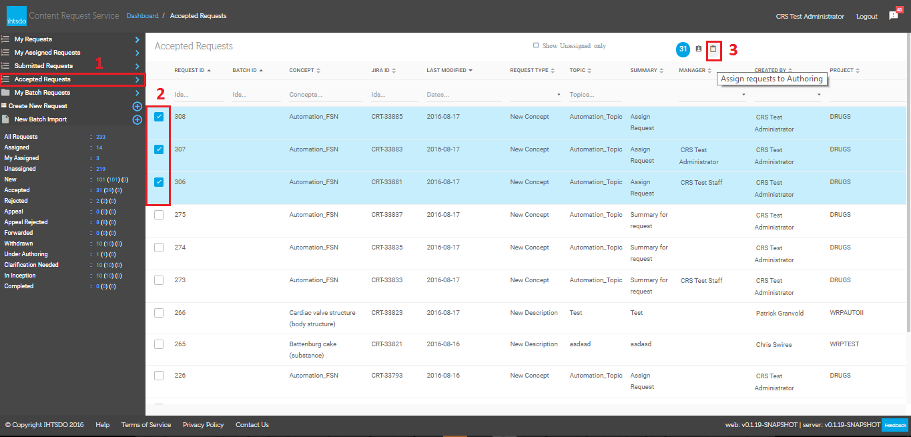
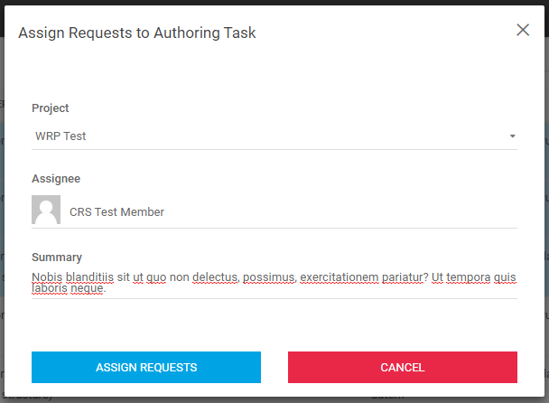
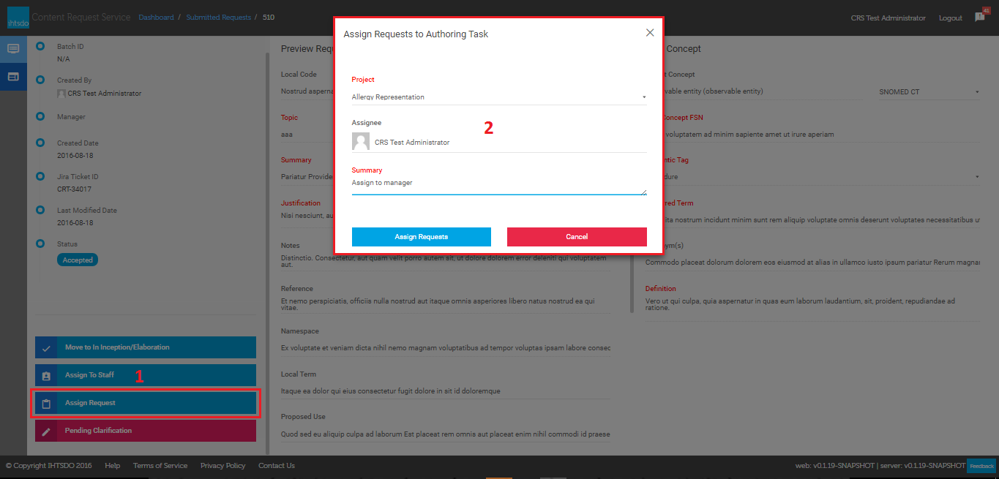
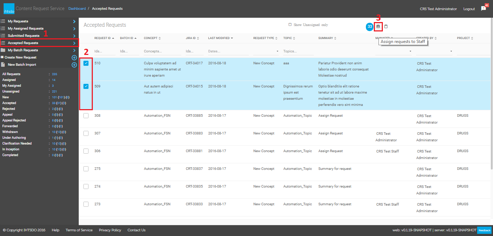
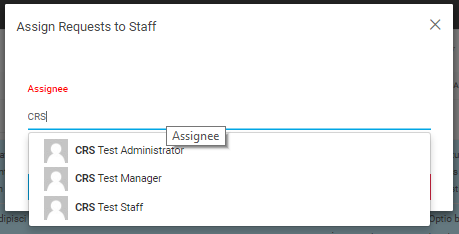
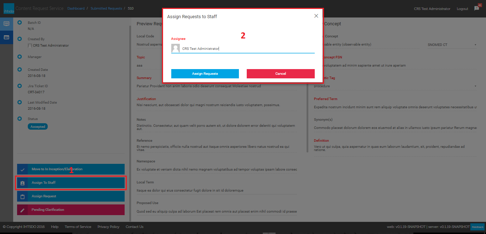

# Reassign Request

## Audience

Applicable to internal users responsible for managing content requests.

### Assign Request to Authoring

  * Assign request from **the Accepted Requests**

From **CRS Dashboard,** click on **Accepted Requests** (1) from the left panel, tick to select accepted request from **the list** (2) then click on **Assign requests to Authoring** button (3) to show assignment dialog | <figure><figcaption>
---|---
</figcaption></figure>  
Select a project from **Project** drop-down list, type assignee name in **Assignee** text box to get suggestions and pick one in list, provide summary for authoring task and click **Assign Requests** button to create task.| <figure><figcaption>
* Assign request from the <strong>Submitted Requests</strong>
</figcaption></figure>  
  

From **CRS Dashboard,** click on **Submitted Requests** from the left panel, click on a **Accepted** request in list then click on **Assign requests** button (1) to show **Assign Requests to Authoring Task (2)** dialog Select a project from **Project** drop-down list, type assignee name in **Assignee** text box to get suggestions and pick one in list, provide summary for authoring task and click **Assign Requests** button to create task.| <figure></figure>  
  
  

## Assign Request to Staff

  * Assign request from the **Accepted Requests**

From **CRS Dashboard,** click on **Accepted Requests** (1) from the left panel, tick to select accepted request from **the list** (2) then click on **Assign requests to Staff** button (3) to show assignment dialog | <figure><figcaption>
---|---
</figcaption></figure>  
Type assignee name in **Assignee** text box to get suggestions and pick one in list, and then click **Assign Requests** button to create task.| <figure><figcaption>
* Assign request from the <strong>Submitted Requests</strong>
</figcaption></figure>  
  

From **CRS Dashboard,** click on **Submitted Requests** (1) from the left panel, click on a **accepted** request from the list and then click on **Assign to Staff** button (1) to show**Assign Requests to Staff (2)** dialog Type assignee name in **Assignee** text box to get suggestions and pick one in list, and then click **Assign Requests** button to create task.| <figure></figure>
