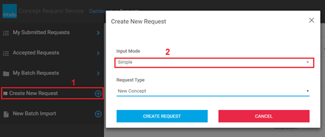

# user-guide-for-manager-draft

## User Guide for Manager - Draft

## Introduction

Take user to the Dashboard page after user logged in successfully.

<figure><figcaption><p><em>Figure 1 - CRS Dashboard</em></p></figcaption></figure>

## 1. Create Requests

### 1.1 Simple Mode

From **CRS Dashboard** (Figure 1), click on **Create New Request** (1), select **Simple** (2) from **Input Mode**

<figure><figcaption><p><em>Figure 2 - Select Simple Mode</em></p></figcaption></figure>

#### 1.1.1 New Concept

Select **New Concept** (3) from drop-down list **Request Type** and click **Create Request** (4)

<figure><figcaption><p><em>Figure 3 - Select New Concept Type</em></p></figcaption></figure>

Select tab **Taxonomy** (1), **Search** or **Saved List** from the left panel to select a desire concept to drag & drop to **Parent Concept** (3) field. And then **Terminology Suggestion**(4) is set automatically to **SNOMED CT**

<figure><figcaption><p><em>Figure 4 - Compose a New Concept</em></p></figcaption></figure>

If you want add more **Parent Concept** , click on the plus icon on each Parent Concept (1) to add. if you want to remove a Parent Concept, click on button on each Parent Concept to remove

<figure><figcaption><p><em>Figure 4.1 - Add more Parent Concept</em></p></figcaption></figure>

If you want add more **Synonyms** , click on the plus icon on each synonym (1) to add. if you want to remove a synonym, click on button on each synonym to remove. do the same with **Definition**(2).

<figure><figcaption><p><em>Figure 5 - Add More Synonyms and Definitions</em></p></figcaption></figure>

Select tab **Request Info** (1) to save (2) the request with **Draft** status which allows you to edit request details before submit, or submit (3) the request to manager/staff. Request details editing is locked after submitted.

\- The mandatory fields need to be answered before save or submit the request.

<figure><figcaption><p><em>Figure 6 - Save or Submit Request</em></p></figcaption></figure>

#### 1.1.2 New Description

Select **New Description** from **Request Type** drop-down list and click **Create Request** button (Figure 7)

<figure><figcaption><p><em>Figure 7 - Select New Description</em></p></figcaption></figure>

Search or browse for a desire concept from the left panel (1) to drag & drop it into **Concept** field (2), enter request details to Save or Submit the request (Figure 6).

\- The mandatory fields need to be answered before save or submit the request.

<figure><figcaption><p><em>Figure 8 - Compose a New Description</em></p></figcaption></figure>

#### 1.1.3 New Relationship

Select **New Relationship** from **Request Type** drop-down list and click **Create Request** button (Figure 3)

Search or browse for a desire Source Concept, Relationship Type, and Destination Concept from the left panel (1) to drag & drop it into each corresponding fields (2), enter request details to Save or Submit the request (Figure 6).

\- The mandatory fields need to be answered before save or submit the request.

<figure><figcaption><p><em>Figure 9 - Compose a New Relationship</em></p></figcaption></figure>

#### 1.1.4 Change or Retire Concept

Select **Change or Retire Concept** from **Request Type** drop-down list and click **Create Request** button (Figure 3)

Search or browse for a desire Concept from the left panel to drag & drop it into **Concept** field, enter request details to Save or Submit the request.

\- The mandatory fields need to be answered before save or submit the request.

#### 1.1.5 Change Description

Select **Change Description** from **Request Type** drop-down list and click **Create Request** button (Figure 3)

Search or browse for a desire Concept from the left panel to drag & drop it into **Concept** field, select a **Current Description** and enter request details to Save or Submit the request.

\- The mandatory fields need to be answered before save or submit the request.

#### 1.1.6 Change Relationship

Select **Change Relationship** from **Request Type** drop-down list and click **Create Request** button (Figure 3)

Search or browse for a desire Concept from the left panel to drag & drop it into **Concept** field, select a **Relationship** that you want to change and enter request details to Save or Submit the request.

\- The mandatory fields need to be answered before save or submit the request.

#### 1.1.7 Retire Description

Select **Retire Description** from **Request Type** drop-down list and click **Create Request** button (Figure 3)

Search or browse for a desire Concept from the left panel to drag & drop it into **Concept** field, select a **Current Description** and enter request details to Save or Submit the request.

\- The mandatory fields need to be answered before save or submit the request.

#### 1.1.8 Retire Relationship

Select **Retire Relationship** from **Request Type** drop-down list and click **Create Request** button (Figure 3)

Search or browse for a desire Concept from the left panel to drag & drop it into **Concept** field, select a **Relationship** that you want to change and enter request details to Save or Submit the request.

\- The mandatory fields need to be answered before save or submit the request.

#### 1.1.9 Other

Select **Other** from **Request Type** drop-down list and click **Create Request** button (Figure 3)

Enter request details to Save or Submit the request.

\- The mandatory fields need to be answered before save or submit the request.

### 1.2 Direct Mode

From **CRS Dashboard** (Figure 1), click on **Create New Request** (1), select **Direct** (2) from **Input Mode**

<figure><figcaption><p><em>Figure 10 - Select Direct Mode</em></p></figcaption></figure>

**Panels in Direct Mode**

<figure><figcaption><p><em>Figure 11 - Panels in Direct Mode</em></p></figcaption></figure>

There are 4 panels in Direct mode, started from left to right:

* **Edit Mode Switcher** (1), on this panel there are 2 buttons which are used to switch between Simple and Direct mode. If there is any change is made from **Direct** mode, the switcher will be disable and user cannot view request details in **Simple** mode. However, if there is any change in **Simple** mode, user can view them in **Direct** mode.
* **Left Panel** (2), there are 4 tabs in left panel:

<figure><figcaption><p>,</p></figcaption></figure>

<figure><figcaption><p>,</p></figcaption></figure>

<figure><figcaption><p>**** ,</p></figcaption></figure>

<figure><figcaption><p>.</p></figcaption></figure>

```
* **Taxonomy** tab allows user to browse concepts in tree view
* **Search** tab allows user to look for their desire concept quickly with suggestions (start showing suggestions after typing 3 characters)
* **Saved List** tab shows saved concepts from **Search** tab. User can drag & drop concepts from **Saved List** to **Edit Panel** (4)
* **Request Info** tab shows request statistics and corresponding buttons for each request status
```

* **Middle Panel** (3) allows you to enter further information for a request
* **Edit Panel** (4) where you provide values for concept's attributes such as synonyms, prefer term, relationships. Below are command buttons in **Edit Panel** :
  *

      <figure><figcaption><p>button to provide change details for a concept</p></figcaption></figure>
  *

      <figure><figcaption><p>Undo changes</p></figcaption></figure>
  *

      <figure><figcaption><p>Redo changes</p></figcaption></figure>
  *

      <figure><figcaption><p>Revert all changes</p></figcaption></figure>
  *

      <figure><figcaption><p>Remove concept from Edit Panel</p></figcaption></figure>
  *

      <figure><figcaption><p>Activate or Inactivate a concept</p></figcaption></figure>
  *

      <figure><figcaption><p>Drag &#x26; Drop button</p></figcaption></figure>
  *

      <figure><figcaption><p>Activate or Inactivate a description or a relationship</p></figcaption></figure>
  *

      <figure><figcaption><p>Add a new concept description or relationship</p></figcaption></figure>
  *

      <figure><figcaption><p>Remove a concept description or relationship</p></figcaption></figure>

#### 1.2.1 New Concept

to create a new concept request by using direct mode, from **CRS Dashboard** (Figure 12) click on **Create New Request** (1), select Direct from **Input Mode** (2) drop-down list, select **New Concept** from **Request Type** (3) drop-down list, and click on **Create Request** (4) button to go to request details editor.

<figure><figcaption><p><em>Figure 12 - Select New Concept in Direct Mode</em></p></figcaption></figure>

**1.2.1.1 Add New Description**

Click button which is on each description row to add a new row of description

<figure><figcaption><p><em>Figure 13 - Add New Synonym</em></p></figcaption></figure>

\*\* **Notes:**\*\*

<figure><figcaption><p><strong>FSN/DEF/SYN</strong> are Fully Specified Name (FSN) , Definition (DEF), and Synonym (SYN)</p></figcaption></figure>

**< locale>: P/A** are the locale 2-digit code (us for USA, gb for Great Britain), and Preferred/Acceptable terms, abbreviated as P and A respectively

_So in the above examples:_\
The first row indicates that the Fully Specified Name is the preferred term in both US and GB dialects of English\
The second row indicates a Definition that is the preferred term in both US and GB dialects of English\
The third row indicates a Synonym that is an accepted term in both US And GB dialects of English

**1.2.1.2 Add New Relationship**

Click

<figure><figcaption><p>button which is on each relationship row, there will be a modal dialog displayed (2), populate your desire options from <strong>Characteristic Type</strong> and <strong>Refinability</strong> drop-down list.</p></figcaption></figure>

<figure><figcaption><p><em>Figure 14 - Add New Relationship</em></p></figcaption></figure>

drag and drop a concept from the left panel (1) to the target concept (2). if you don't want to drag & drop, then you can type in the target concept textbox, CRS will suggest corresponding concept for your keyword. do the same with relationship type (3)

<figure><figcaption><p><em>Figure 15 - Add New Relationship 2</em></p></figcaption></figure>

#### 1.2.2 Change or Retire Concept

To create a new request for change/retire concept by using **Direct** mode, from **CRS Dashboard** (Figure 12) click on **Create New Request** (1), select Direct from **Input Mode** (2) drop-down list, select **Change or Retire Concept** from **Request Type** (3) drop-down list, and click on **Create Request** (4) button to go to request details editor.

Drag & drop a concept from **Left Panel** (1) to the **Edit Panel** area (2) to load concept's details

<figure><figcaption></figcaption></figure>

<figure><figcaption><p><em>Figure 16 - Drag &#x26; Drop Concept to Edit Panel</em></p></figcaption></figure>

**1.2.3.1 Retire a Description**

Click on

<figure><figcaption><p>button (1) of the description which you want to retire, there will be a modal dialog displayed, select a <strong>New Description Status</strong> (2) option then click <strong>Select</strong> (3)</p></figcaption></figure>

<figure><figcaption><p><em>Figure 17 - Retire a Description</em></p></figcaption></figure>

<figure><figcaption><p><em>Figure 18 - Retired Description With Indicator</em></p></figcaption></figure>

**1.2.3.2 Retire a Concept**

Click on

<figure><figcaption><p>button (1) to show the modal dialog (2) to populate relevant information, and then click on Select (3) button to retire concept.</p></figcaption></figure>

<figure><figcaption><p><em>Figure 19 - Retire concept</em></p></figcaption></figure>

### _1.3 SNOMED CT Structure_

#### 1.3.1 Taxonomy details

Click on

<figure><figcaption><p>icon of any item in Taxonomy tab (1) to show the Taxonomy Details dialog (2) to populate relevant information, and can click on the hyperlink (3) in dialog to view relevant information details as Parents, Children…</p></figcaption></figure>

<figure><figcaption><p><em>Figure 20 – Taxonomy details</em></p></figcaption></figure>

#### _1.3.2 Taxonomy list in Dialog_

Click on Taxonomy icon (1) in dialog to view the Taxonomy list.

<figure><figcaption><p><em>Figure 21 – Taxonomy list in dialog.</em></p></figcaption></figure>

## 2. Batch Import and Batch Details

### 2.1 Import New Batch

From CRS Dashboard, click on New Batch Import from the left panel to navigate to the **Batch Import** page. drag & drop or browse for a batch file into upload zone (1).

<figure><figcaption><p><em>Figure 22 - Drag &#x26; Drop File to Import</em></p></figcaption></figure>

The file will be uploaded to the server (1) and notify user once it completed (2) (3), you can click on each tab (4) to review your uploaded requests (figure 22). once you are happy with the file, click I**mport Request** (5) button to show import statistic (figure 23), and then click on **Import** button to import it to the system. Otherwise, you can delete it if you want.

\_

<figure><figcaption><p>_</p></figcaption></figure>

_Figure 22 - Review Batch File and Import_

\_\
\_

<figure><figcaption><p><em>Figure 23 - Import Statistics</em></p></figcaption></figure>

### 2.2 View My Batches

From CRS Dashboard, click on **My Batch Requests** (1) from the left panel to navigate to the **My Batches** page (2).

_Also you can go to the**Batch Import** page by clicking on Import Batch icon (3)._

<figure><figcaption><p><em>Figure 24 - Batch Page</em></p></figcaption></figure>

Click on a batch row to go to batch request detail as below screenshot

<figure><figcaption><p><em>Figure 25 - Batch Statistics and Requests</em></p></figcaption></figure>

## 3. Request Actions

### 3.1 Accept Requests

From **CRS Dashboard** , on **Submitted Requests** , click on a request which has status is **New** to go to request details page

<figure><figcaption><p>Click on <strong>Accept Request</strong> (1) button to accept a request, then you will be redirected to <strong>CRS Dashboard</strong></p></figcaption></figure>

<figure><figcaption></figcaption></figure>

### 3.2 Reject Request

From **CRS Dashboard** , on **Submitted Requests** , click on a request to go to request details page

Click on **Reject Request** (1) button and provide a reason to reject a request, then you will be redirected to **CRS Dashboard**

<figure><figcaption></figcaption></figure>

### 3.3 Pend Request For Clarification

Tickets can only move to Pending Clarification if they are in an **'Accepted'** status. Please move the request to an '**Accepted'** status before attempting request clarification.

From **CRS Dashboard** , on **Submitted Requests** , click on a request to go to request details page.

Click on **Pending Clarification** (1) button and provide a reason to reject a request, then you will be redirected to **CRS Dashboard**

<figure><figcaption></figcaption></figure>

### 3.4 Appeal Rejected Request

From **CRS Dashboard** , on **My Requests** , click on a **rejected** request to go to request details page

Click on **Appeal Rejection** (1) button to appeal a request, then you will be redirected to **CRS Dashboard**

<figure><figcaption></figcaption></figure>

### 3.5 Withdraw Request

From **CRS Dashboard** , on **My Requests** , click on a **submitted** request to go to request details page

Click on **Withdraw Request**(1) button and provide a reason to withdraw a request, then you will be redirected to **CRS Dashboard**

<figure><figcaption></figcaption></figure>

### 3.6 Assign Request to Author

From **CRS Dashboard,** click on **Accepted Requests** (1) from the left panel, tick to select accepted request from the list and can select multiple accepted requests (2) then click on **Assign request to Authoring** button (3) to show assignment dialog.

<figure><figcaption><p>Select a project from <strong>Project</strong> drop-down list in dialog, type assignee name in <strong>Assignee</strong> text box to get suggestions and pick one, provide summary for authoring task and click <strong>Assign Requests</strong> button to create task.</p></figcaption></figure>

<figure><figcaption></figcaption></figure>

### 3.7 Assign Request to Staff

From **CRS Dashboard,** click on **Accepted Requests** (1) from the left panel, tick to select accepted request from the list and can select multiple accepted requests (2) then click on **Assign request to Staff** button (3) to show assignment dialog.

<figure><figcaption><p>Type assignee name in <strong>Assignee</strong> text box to get suggestions and pick one, and then click <strong>Assign Request</strong> button to create task.</p></figcaption></figure>

<figure><figcaption></figcaption></figure>

### 3.8 Filter Requests

#### 3.8.1 Filter request through one or multiple conditions

The **filtering conditions** (1) is displayed below columns header. You can filter requests through **one or multiple conditions** (2). A **notification message** (3) is displayed at the top of page to inform the filtering condition was applied after you stop entering condition and the **request number** (4) also be updated.

<figure><figcaption><p>* User can do this to filtering request in <strong>My Requests, My Assigned, Requests, Submitted Requests, Accepted Requests</strong>.</p></figcaption></figure>

#### 3.8.2 Remove filter conditions are dropdown type

Click on button to remove filter condition for dropdown type.

Do the same with the filtering function in **Submitted Requests, Accepted Requests**.

### 3.9 Delete Request

Tick on checkbox of requests in the **My Requests** list (1), you can select **one** or **multiple requests** (2). Then click on **Remove Selected Requests** icon (3) at the top-right of list. Click on OK button in the **warning message** (4) to delete the selected request.

<figure><figcaption><p>A <strong>confirmation message (4)</strong> is displayed at the top page to notify that the selected requests has been removed successfully.</p></figcaption></figure>

## 4. Notifications

If there is any change which related to your submitted requests such as status changed, new comment added, batch importing completed, then CRS will inform you via its **notification** feature.

from any page of CRS you will see the icon

<figure><figcaption><p>at the very top right of the page, the number of new notifications shall be display as number which next to the icon. You can click on the icon <strong>(1)</strong> to see the list of notifications and click on each message <strong>(2)</strong> to go to request details or batch details.</p></figcaption></figure>

<figure><figcaption><p>*<em><strong>Notes:</strong></em>*</p></figcaption></figure>

CRS only notify user about new comment/feedback/question/answer added if it provided in CRS. For comments which come from out side of CRS such as JIRA, user will not get any notification.

## 5. Statistics

The **statistics (1)** is displayed at the bottom – left page in**Dashboard, My Requests, My Assigned Requests, Submitted Requests, Accepted Requests, My Batch Requests.** User have to view quickly from the status list and can filtering requests by clicking on **counting number (2)** or each status.

<figure><figcaption></figcaption></figure>
