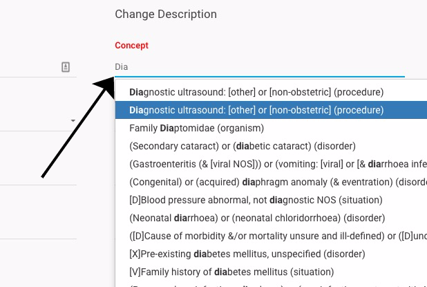

# Using Type Ahead Within CRS

### Using Type Ahead to Locate Concepts or Relationships 

Steps| Reference  
---|---  
Within CRS there may be times where you need to enter in a Concept or Relationship manually. The system will attempt to guess the concept you are looking for by using typeahead. To use, simply enter more then 3 characters to begin searching. Narrow the search results by entering more characters. | <figure></figure>  
This is also applicable for concepts and relationships in Direct Mode| <figure></figure>
